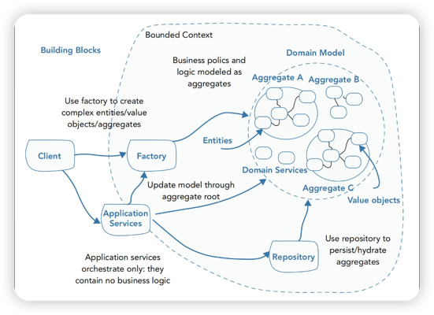

# DDD 基本理论

## 微服务拆分的理论标准：DDD

DDD（Domain Driven Design 领域驱动设计）是一种当下非常流行的系统设计方法论。
- 限界上下文（Bounded Context）
- 实体（Entity）
- 值对象（Value Object）
- 聚合体（Aggregate）
- 工厂（Factory）
- 仓库（Repository）
- 事件（Domain Event）
- 服务（Domain Service）

### 限界上下文（Bounded Context）
- 描述的是我们所要解决的问题的上下文。
- 同样的业务模型在不同的场景之下，特征是不同的。例如，同样是产品，在销售和售后眼里，是不一样的。
- 限界上下文描述了微服务的边界。
- 限界上下文和组织架构可能重合（康威定律）。

判定限界上下文的难点就在于有些东西确实是处于黑白地带，你觉得放到哪里去都合适。

### 实体（Entity）
- **核心在于要有唯一标识符（Identity，身份标识）**。从实际来看，就是要有 ID，这个 ID 用于标记你的业务实体。
- **Entity 会有很多属性**，这些属性在整个生命周期中是会不断修改的。即便有唯一属性，它也不能用表达实体的唯一性。（例如用户的邮箱是唯一的，但是我们始终认为用户 ID 才能唯一代表用户，因为邮箱还是可以改的。）
- 识别实体的要点就在于：**它在你的业务里面是不是一个独立的概念，可以独立存在。**

正常来说，实体在你数据库中必然有一张表，但是数据库中的表却不一定都是实体。

### 值对象（Value Object）
- **值对象没有唯一标识符**，值对象可以看做是一堆属性的集合，由属性标识。
- 在实际中，**哪些不需要 ID 的概念性质的业务对象就是值对象**，比如价格、金额。

一个领域的实体，跑到另外一个领域中，往往就变成了值对象。

### 聚合体（Aggregate）
- **聚合体可以看做是一个实体+N个值对象的集合**，实体也称为聚合根。
- **聚合体使用聚合根的 ID 作为唯一标识符**，在实际中，聚合体一般通过查找出来实体之后，重新计算各种值对象，在内存中构建出来，而不会被持久化（缓存中可能有）。
- **聚合体之间，只能通过 ID 来引用**。在实际中表现为一个聚合体里面不会存在另外一个聚合体，但是可能聚合根的某个字段，是另外一个聚合体的 ID。
- **聚合根是对聚合体修改的唯一入口**。直观来说，就是当你修改订单的信息，都只能从 Order 这个聚合根开始，意味着你总是要调用 order.SetXXX之类的方法。

### 工厂（Factory）
- **就是普通的工厂方法在 DDD 中应用**。大量用于构造实体、值对象或聚合体。它本质上是将构造过程和真实业务逻辑解耦，更好地组织代码。

### 仓库（Repository）
- **仓库是一个数据存储的抽象，它屏蔽了缓存，数据库之类的问题。**
- **仓库大多数时候都是操作聚合体**。如果实体非常简单，以至于不需要和别的值对象组合成聚合体，那么也可以直接操作实体（不推荐）。
- 简单来说，仓库就是对聚合体的增删改查。

### 事件（Domain Event）
- **DDD中的事件就是一般我们所说的事件**，代表的是系统发生了一件什么事情。大多数时候就是聚合体数据的变化，比如说订单状态变更。
- **事件的发布者和监听者，既可以是 Service，也可以是聚合体**。外面可以再套上具体的消息队列的生产者和消费者的皮。
- **复杂事件依旧可以使用工厂模式来构建。**
- **事件是从属于一个领域的，但可以被多个不同的领域关心。**

最直观的认知就是，往消息队列里面发的消息，就是领域事件。

### 服务（Domain Service）
一般来说，我们希望尽可能将业务逻辑分散在聚合体、实体或者值对象里面。**但是部分业务逻辑跨越了多个聚合体，因此就引入了 Service 来完成这部分事情。**

实际上，**在一般的 CRUD 项目中，Domain Service 是没有什么代码的。**

因为跟存储、查询有关的内容，都是被 Repository 处理掉了。