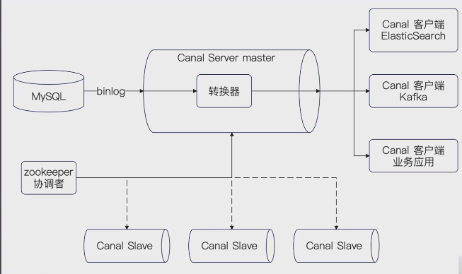
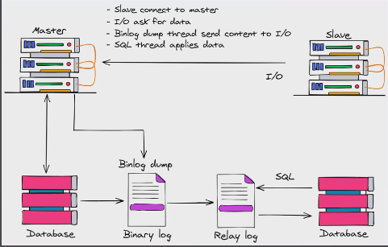

# Canal

## Canal 是什么
- **Canal 是一款开源的数据库实时变更监控和数据同步工具**，支持多种数据库系统，包括 Mysql、MariaDB、阿里云 RDS 等。
- **它允许实时捕获数据库的变更，提供高性能的数据同步服务**，被广泛应用于数据仓库同步、实时分析等场景。

或者说，Canal 是一个典型的 CDC（changge data capture）工具。

优势：
- **实时性高**：Canal 提供实时的数据变更监控和同步，使得系统能够更迅速地响应数据库的变更。
- **灵活性高**：Canal 的配置和使用相对简单，可以轻松应对不同场景的数据同步需求。
- **开源社区支持**：由于是开源工具，Canal 受到了活跃的开源社区支持，可以获取到及时的更新和问题解决方案。


## Canal 的作用
- **实时监控数据库变更**：Canal 允许你实时监控数据库的变更，包括插入、更新和删除操作。这种实时性对于需要及时了解数据库变更的应用场景非常重要。
- **数据同步**：Canal 提供了高效的数据同步机制，可以将一个数据库的变更同步到另一个数据库，保持数据一致性。这对于分布式系统中的数据同步是至关重要的。
- **支持实时分析**：Canal 的实时性使得数据能够被及时传输到数据仓库或分析平台，支持实时数据分析和报告生成。这对于需要快速响应数据变化的业务非常有用。
- **解耦数据库系统**：使用 Canal 可以帮助解耦不同数据系统之间的依赖关系。这意味着你可以在系统中引入新的数据库或更改数据库结构，而不必担心影响到其他部分的运作。


## Canal 的基本组成
- **Canal Server**：基本组件之一，负责连接到数据库，并实时监控数据库的变更。它捕获变更日志并将其发送给连接的客户端。
- **Canal Client**：Canal Client 是与 Canal Server 进行通信的组件，用于接收并处理从 Canal Server 发送过来的数据库变更。应用程序可以通过 Canal Client 获取实时的数据库变更信息。
- **Binlog**：Canal 使用数据库的二进制日志进行实时监控和捕获变更。
- **数据格式转换器**：Canal 支持多种数据格式，例如 JSON、Avro 等。数据格式转换器负责将从数据库捕获的变更日志转换为用户指定的数据格式。
- **Canal 配置文件**：Canal 的配置文件包含了与数据库连接、监控规则、数据格式等相关的配置信息。通过配置文件，用户可以灵活地定制 Canal 的行为。
- **ZooKeeper（可选）**：在分布式场景中，Canal 可以使用 Zookeeper 来进行服务的协调和管理。Zookeeper 提供了高可用和容错性的支持。




## 什么是 Binlog？
Binlog 是数据库中的二进制日志，**记录数据库中的每个变更操作**。它包含了对数据库进行插入、更新和删除的详细信息。

它是 Canal 实时捕获变更的重要基础。



如上图展示了 Binlog 用于主从同步。基本上就是四个步骤：
- 从库连上主库。
- 从库发起数据同步。
- 主库开启一个线程，Binlog发送到从节点。
- 从节点收到 Binlog，先写到 Relay log，而后逐步执行 Relay log 中的数据变更。

### Relay log
- 记录同步过来的每一个操作，如果从库崩了也能恢复
- 平衡主库和从库之间的速率


### Binlog 的三种模式
- **Row-based logging(基于行的日志记录)**：记录每行数据的变更，适用于那些以行为单位进行数据变更的场景。这种模式提供了最详细的变更信息，但可能会产生较大的日志量。
- **Statement-based Logging(基于语句的日志记录)**：记录 SQL 语句的执行，以表达数据变更的操作。这种模式适用于那些以 SQL 语句为单位进行数据变更的场景。它生成的日志量相对较小，但可能无法捕获一些复杂的数据变更情况。
- **Mixed Logging(混合模式日志记录)**：结合了行级和语句级两种日志记录模式的优势。在这种模式下，数据库根据具体的数据变更情况使用行级或语句级记录。这种模式平衡了详细信息和日志量之间的权衡。

Canal 支持解析和处理这三种不同的 Binlog 模式，因此用户可以根据实际情况选择适合其应用的模式。
个人认为，基于行的日志记录用起来方便。


## Canal 的配置
Canala 的配置比较复杂，需要配置的东西也比较多。
它的配置大体上分成三个部分：
- **Canal Server 本体的配置**。也就是 Canal Server 自己运作需要的配置。
- **连上不同数据库的配置**。每次你要连一个不同的数据库，你就需要提供一份配置。这一份配置的关键就是提供连上数据库必要的连接信息、用户信息。
- **转发配置**。也就是 Canal 收到了 Binlog 之后，要把这个数据转发到哪里。

```toml
canal.admin.port = 11110
canal.admin.user = admin
canal.
```