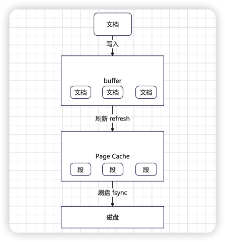

## ElasticSearch 简介

- **ElasticSearch 是一个基于 Lucene 的搜索和分析引擎**，他可以快速、可靠地存储、检索和分析大量数据。
- **ElasticSearch 的设计目标是提供一种简单、高效的方式来存储、搜索和分析大量数据**，从而帮助开发人员快速构建和部署应用程序。
- **ElasticSearch 支持近实时搜索**，这意味着数据可以在几秒内被索引和搜索。
- **ElasticSearch 支持极大数据量**，它的分布式特性使其能够扩展到数十个节点和数百个节点，从而支持 PB 级数据的存储和检索。
- **ElasticSearch 提供了灵活的 RESTful API**，可以轻松地与各种编程语言和应用程序集成。

### 为什么使用 ElasticSearch
- **高性能**：ElasticSearch 是在 Lucene 基础上构建而成的，因此在全文本搜索方面变现十分出色。
- **近实时**：它同时还一个近实时的搜索平台，从文档索引操作到文档变为可搜索状态之间的延时很短，一般只有一秒。
- **大数据**：ElasticSearch 将文档分布在不同的分片中，可以进行复制以提供数据冗余副本，以防发生硬件故障。这使得ElasticSearch 可以支持 PB 级数据，并且防止数据丢失。
- **丰富的功能**：ElasticSearch 还有大量强大的内置功能（例如数据汇总和索引生命周期管理），可以方便用户更加高效地存储和搜索数据。
- **灵活的查询和搜索操作**：ElasticSearch 支持各种查询操作，如基本查询、范围查询、模糊查询等，同时还可以进行复杂的聚合操作和排序。ElasticSearch 提供了一个易于使用的 RESTful API，可以轻松地与各种编程语言和应用程序集成。
- **社区支持与生态系统**：ElasticSearch 有一个活跃的社区，提供了大量的插件和工具来扩展其功能。此外，还有许多第三方公司和服务提供商提供 ElasticSearch 的支持、培训和咨询服务。

### ElasticSearch 的基本概念

ElasticSearch 的基本概念分成两大类：
- 数据的组织方式：
- - **索引**：类比 MYSQL 的表。
- - **文档**：类比 MYSQL 的表的数据。
- 数据的部署方式，主要讨论的分片和副本：
- - **分片**：类比关系型数据库的分库分表。
- - **副本**：类比主从同步中的从库。

本质上来说，目前的大型中间件都有类似的机制：
- 分片：没有办法将数据都放在同一个地方，因为单节点撑不住。
- 副本：没有副本的话，节点已经奔溃了，数据就全没了。

#### 索引与倒排索引
一般我们讨论索引的时候有两重含义：
- 一个是指数据本身，也就是类比 MYSQL 表的那个概念。
- 另外一个**是指 ElasticSearch 特殊的索引形式，倒排索引。**

倒排索引是相比正排索引而言的。

正排是指：你找到数据了，就知道它有什么属性。
倒排是指：你得从有什么属性出发，找到这些属性的数据。


#### 倒排索引的组织方式


#### 节点与节点类型

在 ElasticSearch 里面，节点一般是指一个 ElasticSearch 的实例。

而一个实例本身可以扮演多个角色，这是最主要的几种角色：
- **候选主节点（Master-eligible Node）**：可以被选举为主节点的节点，和主从结构相关。
- **协调节点（Coordinating Node）**：协调节点负责协调请求的处理过程，和分片相关。你可以理解为，类比于解决分库分表查询的 Mysql 代理。
- **数据节点（Data Node）**：存储数据的节点。

在一家公司里面，尽量不要让节点兼职，也就是让节点只专注于扮演一个角色。


#### 写流程

这算是一个面试的热点中的热点了。

在传统的概念中，写入好像就是直接写在磁盘上。但是实际上并不是的，写入流程在不同的中间件中有不同的设计，它会极大的影响中间件的性能。

在 ElasticSearch 里面，分成这几步：
- **文档首先被写入到 Buffer 里面**，这个是 ElasticSearch 自己的 Buffer。
- **定时刷新到 Page Cache 里面**。这个过程叫做 refresh，默认是1秒钟执行一次。
- **刷新到磁盘中，这时候还会同步记录一个 Commit Point。**

当数据刷新到 Page Cache里面，数据就可以被搜索到。这也就是我们说的 ElasticSearch 是一个近实时中间件的原因。




### http 接口

#### 创建索引

put 访问 http://localhost:9200/index_name

```json
{
  "settings": {
    "number_of_shards": 3,
    "number_of_replicas": 2
  },
  "mappings": {
    "properties": {
      "email": {
        "type": "text"
      },
      "phone": {
        "type": "keyword"
      },
      "birthday": {
        "type": "date"
      }
    }
  }
}
```

#### 查看索引

get 访问 http://localhost:9200/index_name

#### 写入数据

post 访问 http://localhost:9200/index_name/_doc

如：
```json
{
  "email": "321@qq.com",
  "phone": "17620096266",
  "birthday": "2000-01-01"
}
```

#### 查询数据
get 访问 http://localhost:9200/index_name/_search

```json
{
  "query": {
    "match": {
      "email": "321@qq.com"
    }
  }
}
```


### ElasticSearch 字段类型
- **核心数据类型**：
- - 字符串数据类型：text(分词)、keyword(不分词)。
- - 数值型：如long、integer、short、byte、double、float、half_float、scaled_float。
- - 日期类型：date
- - 二进制类型：binary
- - 范围类型：如 integer_range、float_range、long_range、date_range。
- **复杂数据类型**：
- - 数组类型：不需要专门的类型来定义数组。
- - 对象类型：object，单独的 json 对象。
- - 嵌套类型：nested object。
- **地理位置数据类型**：
- - 地理点数据类型：geo_point，经纬点。
- - 地理形状数据类型：geo_shape，多边形的复杂地理形状。
- **专用数据类型**：
- - IPV4 数据类型：IP 协议为 IPV4的地址。
- - 完成数据类型：completion，提供自动补全的建议。
- - 单词计数数据类型：token_count，统计字符串中的单词数量。

#### keyword 和 text 的区别

keyword 类型的优点包括：
- **适用于精确匹配**：keyword 类型适用于需要精确匹配的场景，例如搜索特定的标签、状态码、邮箱地址等。
- **支持聚合**：Keyword 类型适用于聚合操作，例如对特定字段进行分组、计数等。
- **不知你分词**：Keyword 类型的字段不会进行分词，因此可以加快索引速度。

缺点：
- **不适用于全文搜索**：Keyword 类型不适用于需要进行全文搜索的场景，因为它是针对精确匹配设计的。
- **限制了查询方式**：Keyword 类型的字段只能进行精确匹配或者范围查询，查询方式相对有限。
- **可能影响性能**：如果字段中存储的数据量很大，Keyword 类型可能会影响查询性能。

Text 类型的优点：
- **支持全文搜索**：Text 类型适用于需要进行全文搜索的场景，例如搜索文章、描述等文本。
- **可进行模糊匹配**：Text 类型支持模糊匹配，可以使用通配符、正则表达式等进行查询。
- **支持分析器**：Text 类型可以使用分析器对文本进行分词、词干提取等处理，提高搜索准确率。

缺点：
- **不适用于精确匹配**：Text类型不适用于需要精确匹配的场景，因为它是针对全文搜索而设计的。
- **可能影响性能**：如果字段中存储的数据量很大，Text 类型可能会影响索引和查询性能。
- **需要额外配置**：Text 类型需要配置分析器等参数，相对比较麻烦。


### ES 支持的查询：
- **Match Query(匹配查询)**：根据字段中的内容进行全文查询。
- **Term Query(精确查询)**：根据字段中的精确值进行查询，适用于 keyword 类型或者已经执行过分词器的字段。
- **Range Query(范围查询)**：根据字段中的范围值进行查询，可以用来查询数字或者日期范围。
- **Bool Query(布尔查询)**：通过逻辑运算符(must、must_not、should)组合多个查询条件，实现更复杂的查询逻辑。
- **Match Phrase Query(短语匹配查询)**：根据字段中连续的短语进行查询，使用于需要保持短语顺序的查询。
- **Prefix Query(前缀查询)**：根据字段中的前缀进行查询，适用于需要按照前缀匹配查询的场景。
- **Wildcard Query(通配符查询)**：根据通配符进行查询，支持通配符符号(*和?)进行模糊匹配。
- **Fuzzy Query(模糊查询)**：根据字段中的模糊匹配进行查询，可以通过设置 fuzziness 参数来控制模糊程度。
- **Nested Query(嵌套查询)**：根据嵌套对象进行查询，以便查询嵌套在文档中的相关信息。
- **Aggregation Query(聚合查询)**：用于计算、统计和分析数据，包括求和、平均值、最小值、最大值、分组等操作。


```go
package grpclive

import (
	"context"
	"strings"
	"testing"
	"time"

	elastic "github.com/elastic/go-elasticsearch/v8"
	olivere "github.com/olivere/elastic/v7"
	"github.com/stretchr/testify/assert"
	"github.com/stretchr/testify/require"
	"github.com/stretchr/testify/suite"
)

type ElasticSearchTestSuite struct {
	suite.Suite
	es  *elastic.Client
	oli *olivere.Client
}

func (s *ElasticSearchTestSuite) SetupSuite() {
	client, err := elastic.NewClient(elastic.Config{
		Addresses: []string{"http://localhost:9200"},
	})
	require.NoError(s.T(), err)
	s.es = client

	oli, err := olivere.NewClient(olivere.SetURL("http://localhost:9200"))
	require.NoError(s.T(), err)
	s.oli = oli
}

func (s *ElasticSearchTestSuite) TestCreateIndex() {
	ctx, cancel := context.WithTimeout(context.Background(), 3*time.Second)
	defer cancel()

	cre := `
		{
  "settings": {
    "number_of_shards": 3,
    "number_of_replicas": 2
  },
  "mappings": {
    "properties": {
      "email": {
        "type": "text"
      },
      "phone": {
        "type": "keyword"
      },
      "birthday": {
        "type": "date"
      }
    }
  }
}
	`
	// 这是一个链式调用，可以通过链式调用来构造复杂请求
	// 重复创建会报错
	resp, err := s.es.Indices.Create("user_idx_test1",
		s.es.Indices.Create.WithContext(ctx),
		s.es.Indices.Create.WithBody(strings.NewReader(cre)),
	)
	require.NoError(s.T(), err)
	assert.NotNil(s.T(), resp)
	assert.Equal(s.T(), resp.Status(), "200")

	respv1, err := s.oli.CreateIndex("user_idx_test2").Body(`
	    {
  "settings": {
    "number_of_shards": 3,
    "number_of_replicas": 2
  },
  "mappings": {
    "properties": {
      "email": {
        "type": "text"
      },
      "phone": {
        "type": "keyword"
      },
      "birthday": {
        "type": "date"
      }
    }
  }
}
	`).Do(ctx)
	require.NoError(s.T(), err)
	assert.NotNil(s.T(), respv1)
}

func (s *ElasticSearchTestSuite) TestPutDoc() {
	ctx, cancel := context.WithTimeout(context.Background(), 3*time.Second)
	defer cancel()
	resp, err := s.es.Index("user_idx_test", strings.NewReader(`
	"email": "test1@163.com",
	"phone": "1234567890",
	"birthday": "2000-01-01"
	`), s.es.Index.WithContext(ctx))
	require.NoError(s.T(), err)
	assert.NotNil(s.T(), resp)
	assert.Equal(s.T(), resp.StatusCode, 201)

	respv1, err := s.oli.Index().Index("user_idx_test").BodyJson(map[string]interface{}{
		"email":    "test2@163.com",
		"phone":    "1234567890",
		"birthday": "2000-01-01",
	}).Do(ctx)
	require.NoError(s.T(), err)
	assert.NotNil(s.T(), respv1)
}

func (s *ElasticSearchTestSuite) TestGetDoc() {
	ctx, cancel := context.WithTimeout(context.Background(), 3*time.Second)
	defer cancel()
	resp, err := s.es.Search(s.es.Search.WithContext(ctx), s.es.Search.WithIndex("user_idx_test"), s.es.Search.WithBody(strings.NewReader(`{"query": {"match_all": {
	}}}`)))
	require.NoError(s.T(), err)
	assert.NotNil(s.T(), resp)
	assert.Equal(s.T(), resp.StatusCode, 200)

	query := olivere.NewMatchQuery("email", "test1@163.com")
	respv1, err := s.oli.Search("user_idx_test").Query(query).Do(ctx)
	require.NoError(s.T(), err)
	assert.NotNil(s.T(), respv1)
}

func TestElasticSearch(t *testing.T) {
	suite.Run(t, new(ElasticSearchTestSuite))
}

```