# Feed 流

## 什么是 Feed 流？
Feed 流系统是一种实时数据传递和处理系统，**用于将实时生成的数据（如消息、更新、通知）传递给应用程序的用户**。

它的特点有：
- 实时性：数据实时推送，确保用户获取最新信息。
- 个性化：根据用户兴趣和行为调整展示内容。
- 多样性：支持各种类型的内容，如文本、图片、视频等。

它本身强调两方面内容：
- 将和用户有关的数据整合起来。
- 按照时间展示给用户。

所以一般都会说 Feed 流，取其百川归流，绵绵不绝的意思。


## Feed 流系统的用途
- **社交媒体**：
- - 提供用户动态、评论、点赞等实时更新。
- - 促进社交互动，增强用户黏性。
- **新闻应用**：
- - 实时推送最新新闻和热门话题。
- - 个性化推荐，提高用户体验。
- **电子商务**：
- - 展示个性化商品推荐。
- - 实时更新促销信息和用户评价。
- **实时协作工具**：
- - 在团队协作中分享实时进展和更新。
- - 支持团队成员即时互动。
- **视频分享平台**：用于推送用户关注的频道或创作者的最新视频，以及相关的评论和互动信息。
- **在线教育平台**：推送最新的课程内容、作业提醒和同学互动信息，以促进学习社区的建立。
- **博客和内容创作平台**：展示博主或创作者的最新文章、评论以及其他相关的话题，以增加内容的曝光和社交互动。
- **游戏应用**：用于显示好友动态，成就达成以及游戏内事件，增强玩家社交和互动性。


## Feed 流设计概要
从前面的定义里面，你应该看到：Feed 流系统是一种实时数据传递和处理系统，旨在将实时生成的内容以流的形式传递给系统的用户。

而**数据的形式则是多样的，可以是视频、文章、照片等**。

其来源也是多样的。在以用户关系为核心的泛娱乐平台里面，主要来自于关注的用户。

而后考虑按照时间组织起来。

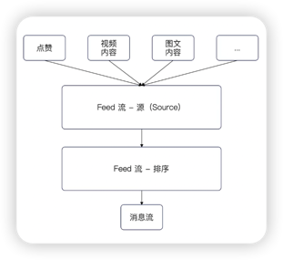

如上图所示，是一个简单的 Feed 流系统展示，最后输出的消息流，就是终端用户看到的数据。


## Feed 流需求分析
现在我们在 webook 里面需要考虑的是第一个问题：用户的 Feed 流究竟应该由什么组成？

从已有功能来说，Feed 流的数据来源可以包括：
- **用户关注的人发表了新的作品。**
- **用户发表的作品被人点赞、收藏、评论了。**
- **用户发表的评论被人回复了。**
- **有人关注了该用户。**
- **系统通知**，这部分就是完全取决于具体系统包含什么通知了。

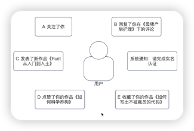


### 使用哪些数据来组织 Feed 流
目前的平台在组织 Feed 流的时候大体上有两种方式：
- 第一种方式**是把前面列举的内容都合并在一起**。
- 第二种方式是**只把关注者发表新作品做成 Feed 流**，其余的东西做成系统通知。

这里我们**选择第一种方式，因为从系统设计的角度来说，这种方式要更加复杂**。你可以删减代码来转化为第二种方式。

PS：正常来说，这部分决策实际上是产品经理来确定的，我们研发只需要负责根据决策来设计和实现系统就可以了。


## Feed 流设计模式一：拉模型
既然我们决定将所有和用户有关的信息都放到 Feed 流里面，那么现在就有一个问题，我们怎么获得这些数据？

一种比较直观的设计和实现方式是：**在展示某个用户的 Feed 流的时候，就直接从不同来源的数据库里面搜索出来数据，而后重新整理排序**。这种就是所谓的拉模型。

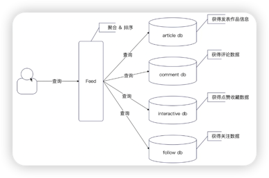


### 拉模型的缺陷
- 用户每次发起一个查询请求，最终会扩散为**N个数据库查询，对数据库压力很大**。
- **分页问题难以处理**。正常的 Feed 流在查询的时候都是分页返回的，例如说每次返回20条。而这20条都是按照时间戳来排序的，所以在查询的时候根本无法知道这20条会贼哪些数据库上。

分页的关键是，因为我们无法知道前20条究竟在哪个数据库上，所以我们只能每个数据库都找出前20条，而后在内存中自己排序，再取前20条。

ps：分库分表中间件处理跨表分页查询的时候，就是这么处理的。

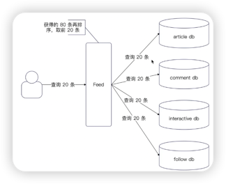


## Feed 流设计模式二：推模型
拉模型有那么多缺陷之后，显然我们可以考虑使用推模型。

**推模型就是以 Feed 模块为核心，不同的业务方将数据推送过来。**

你在搜索的时候接触过这种设计了。在搜索模块中，也是不同的业务方主动把数据推送过来。

那么站在一个系统设计者的角度，我们肯定是希望使用推模型的。毕竟拉模型的性能实在是太差了。

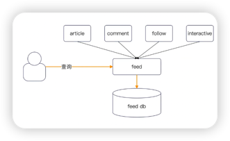


## Feed 流设计：读扩散与写扩散
很显然，前面我们肯定是决定要用推模型，也就是各个业务方的数据自己推过来。

但是在 Feed 流里面还有另外一种推拉模型的说法，对应的概念更加接近读扩散和写扩散。

即读扩散 = 拉模型，写扩散 = 推模型。当你和别人在讨论 Feed 的时候，要注意他说的哪个含义。

现在我们假定都是业务方将数据推送过来，并且 A 关注了 B。

那么**当 B 发表了一篇新文章的时候，这个时间在 Feed 这边该如何存储，以及如何被查询呢？**

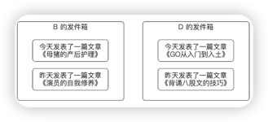

如上图，是读扩散的模型。B 有一个自己的收件箱，记录了这一个用户产生的，用于关注 B 的人生成 Feed 流的数据。


### 读扩散下的查询方式
在读扩散下，查询要更加麻烦一些。它同样要求去查询出来所有的收件箱里面，和查询用户有关的数据。
如下图，假设说 A 关注了 B 和 C，但是没有关注 D。那么 A 的 Feed 流在生成的时候，就需要查询出来 B 和 C 的数据，但是不需要查询 D 的数据。
**这里的关键就是要从用户关系那里查询出来 A 究竟关注了哪些人。**

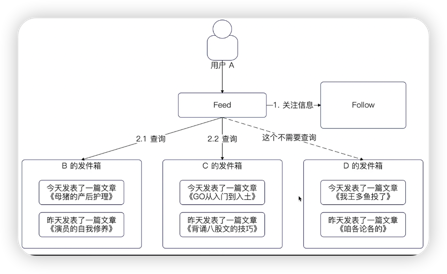


### 读扩散的问题
读扩散的问题你基本上都能猜到：查询性能差。

也就是说，至少需要三步：
- **先查询 A 关注了哪些人；**
- **再查询 A 关注的人里面，发件箱里面有什么数据；**
- **而后聚合排序，取出需要的数据。**

在小规模集群里面，收件箱就是一张表，类似下面的定义。
```go
// Outbox 收件箱
type Outbox struct {
	Id int64
	// 收件人
	Uid int64
	Content string
	// 其他字段
}
```

但是在大规模集群下，在使用关系型数据库的时候，必然是分库分表。

即便是 NoSQL，也会涉及到跨分区查询的问题，所以性能都比较差。


## 写扩散
读扩散对应的设计是收件箱，那么你大概能过猜到写扩散对应的设计就是收件箱了。

也就是说，**每一个用户有一个逻辑上的收件箱。当他关注的人发布新作品时，就把对应的数据写入到这个收件箱里面。**

如下图，加入说 A 关注了 B，那么 B 在发表一篇新的文章的时候，就会把这条数据写入到 A 的收件箱。

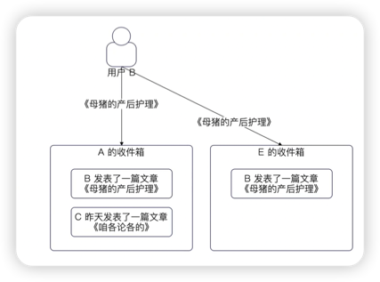

如果还有 E 也关注了 B，那么会同步写入到 E 的收件箱。


### 写扩散的缺陷
**写扩散的缺陷也很明显，极大地放大了写流量。**

试想一下，假设 B 有一百万粉丝。那么当 B 发表一篇新的文章的时候，就要同步给这一百万个粉丝。
也就是瞬间产生了一百万条记录。

而类似于 B 站这种，百万粉丝的 UP 主还是很多的，而在微博这种平台，粉丝数量上千万也不在少数。

因此写扩散会产生极大数据量，写入过程本身就会很慢。


### 写扩散的查询方式
写扩散的查询就要简单很多。

**A用户在查询自己的数据的时候，并不需要去查询 follow 模块获得关注信息，只需要查询自己的收件箱就可以了。**

收件箱的极简设计：
```go
type Inbox struct {
	Id int64
	// 收件人
	Uid int64
	Content string
	// 其他字段
}
```

即便是在考虑分库分表的情况下，那么也是按照 Uid 来进行分库分表的。
也就是说，同一个用户的数据在经过分库分表之后，也必然在同一张目标表上。

因此一次查询就可以成功得到数据，还可以借助数据库来进行分页，而不需要自己去聚合排序。


## 读扩散和写扩散的综合运用
所以，在实践中一般是混合了写扩散和读扩散两种方式。

基本思路就是：**如果一个人的粉丝并不多，那么就直接使用写扩散模型；如果一个人的粉丝很多，那么就使用读扩散模型。**

但是这里面还有一种进化玩法，就是根据粉丝是不是活跃用户，在写入数据的时候，针对活跃用户进行写扩散。

如下是一个简单的写入流程图：
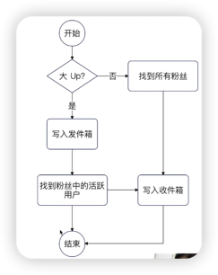

PS：在一些平台，限制住了最大粉丝数量，例如微信限制住了每个人的好友数量，所以就可以考虑只采用写扩散。


### 读扩散和写扩散的综合运用：读流程
读数据的时候，也需要同事从 收件箱和发件箱里面读取数据。

基本步骤就是：
- **当 A 要读取数据的时候，先找到自己的收件箱；**
- **而后 A 要找到他关注的那些人，例如 B，从 B 的发件箱里面找到数据；**
- **合并这些数据，并且进行排序分页。**

如果叠加了活跃粉丝的设计，那么**A发现自己是活跃用户，就不会去找自己关注的人。**

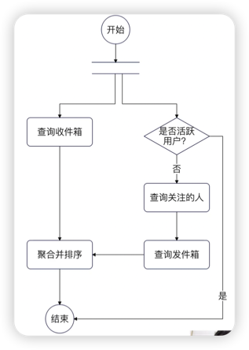


## 综合使用的优缺点？
综合使用只能说是一个还不错的方案，是我们在读扩散和写扩散之间做了权衡之后不得不考虑的方案。
- 从写流程来说，它依旧有写扩散的问题，但是我们能够限制住写扩散的数据并不多。
- 从读流程来说，它依旧有聚合排序的问题。如果发件箱已经分库分表的话，那么会存在跨库跨表查询的问题。

只是说，这两个缺陷都比单独使用读扩散或者单独使用写扩散要轻微，而不是完全没有。

这个综合方案来说，可以优先保障活跃用户的使用体验，而对于非活跃用户来说，它的查询性能就要稍微差一些。

**这里我们准备使用的就是叠加了读扩散和写扩散的解决方案**，但是并不准备考虑是否活跃用户的问题。


## 数据存储设计
现在我们要解决的是第一件事：怎么存储业务方同步过来的数据。

这个问题的难点之处在于，**Feed 里面不同类型的数据，字段会不一样。**

如下图，是我们准备支持的组成 Feed 流的不同类型的事件。
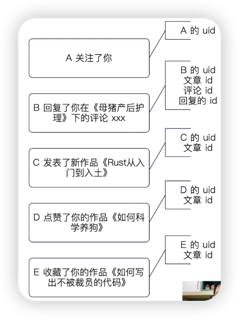

如果我们进一步考虑，就会发现我们是否要存储一些冗余数据。例如说用户的昵称、文章的标题等。

冗余数据的好处是，在查询的时候可以直接从 Feed 里面拿到最为完整的数据，而不需要进一步回查业务方。

在实践中，死否冗余都可以，你可以根据自己的实际情况来决定。


## 如何存储扩展数据
扩展数据，也就是不同的 Feed 事件里面独有的那些数据。

从数据库存储设计上来说，有两种方案：
- **一个大的 JSON 字段存储这些所有的扩展数据**。优点是简单方便，缺点是这部分数据无法参与关系型运算（也就是没有办法用在 Where里面）。
- **使用扩展表**。也就是说有一个基本的 Feed Event 表，而后根据不同的事件，定义出来不同的扩展表。如下面的代码就是这种设计。缺点就是代码写起来特别麻烦，工作量会多几倍。
```go
type FeedEvent struct {
	Id int64
	Type string
	// 公共字段，可以继续加
}

tyoe ArticleEvent struct {
	Id int64
	// 指向的是 FeedEvent 的id
	Fid int64
	
	// 文章 id
	Aid int64 
	// 如果你要冗余字段，这里加字段
	// Title string
}
```
我们采用第一种设计方案，因为在当下我们并没有任何要将这些数据参与关系型运算的需求。

