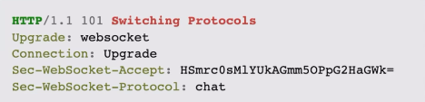

# IM
Im(Instant Message)，也叫做即时通讯。

**及时通信是一种通过实时传递文本、多媒体内容和文件的通信方式**。它使得用户能够在几乎瞬时内与他人交流，消除了时间和地理上的限制。

简单来说，就是日常使用的聊天工具。目前IM在现代社交和工作中扮演了重要的角色。
- **社交连接**：IM成为了人们日常社交的主要方式，提供实时的沟通和分析体验。
- **企业协作**：在商业环境中，团队和合作伙伴使用IM进行实时沟通，提高效率和协作水平。
- **全球化工作**：随着全球化趋势，IM弥合了时区和地域的差异，使全球团队更容易协同工作。


## IM 的主要特征
- **即时性：消息的实时传递**
- - 实时通信协议：IM依赖于实时通信协议，如XMPP或者WebSocket，以确保消息能够迅速传递。
- - 即时通知：用户可以立即收到新消息的通知，确保及时响应和交流。
- **多媒体支持：文本、图片、音频、视频**等
- - 文本消息：基本的文本聊天是IM的核心功能，支持表情符号和表情以增加交流表达。
- - 图片和文件分析：用户可以轻松共享图片、文档和其他文件，丰富信息传递。
- - 音频和视频通话：提供实时的语音和视频通话功能，使远程交流更加生动和直观。
- **跨平台性：在不同设备和操作系统上的使用**
- - 移动设备：IM应用通常在IOS和Android平台上都有应用程序，支持在智能手机和平板电脑上的使用。
- - 桌面应用：用户可以在Windows、MacOS等桌面平台上使用IM应用，实现多终端同步和访问。
- - web版：一些IM工具提供基于Web的版本，用户可以通过浏览器访问，增加了灵活性和便捷性。

**不同类型的消息在展示、存储上有不同的要求，所以在实践中是比较难处理的一个点。**


# IM 核心协议

## XMPP
在设计和实现IM的时候，有多种可行的技术方案，最常见的三种 **XMPP、WebSocket 和 WebRTC**。

先来看第一种：**XMPP**（EXtensible Messaging and Presence Protocol），它的特定是：
- **开放标准**：XMPP是一种开放的、基于XML的通信协议，支持扩展，具有广泛的可定制性。
- **即时消息和在线状态**：提供实时消息传递和在线状态管理的功能。
- **多终端支持**：具备多终端同步的能力，用户可以在不同设备上访问消息历史。

这个协议你可以认为最开始就是为通信设计的，只不过后面影响力不太行。但是如果你想要设计一个能和别的IM通信的IM，那么XMPP是一个很不错的选择。

https://xmpp.org/


## WebSocket
现在主流的 IM 基本上都是构建在 WebSocket 上。

WebSocket 不仅仅用于实现双向通信，还在在线游戏、实时协作等场景中被广泛使用。

也常用于Web应用中，通过浏览器与服务器进行实时数据传输。

特点是：
- **双向通信**：提供全双工通信，允许服务器主动向客户端推送消息。
- **低延迟**：实时性比较高，适用于对低延迟要求较高的应用场景。
- **跨域支持**：WebSocket 支持跨域通信，允许在不同域之间建立连接。


## WebRTC
WebRTC 这几年也非常流行，主要用于实现浏览器之间的实时音频通信，适用于Web会议、在线教育、视频聊天等应用。

也可以嵌入到即时通信应用中，提供音视频通话功能。

https://webrtc.org/

特点：
- **实时音视频通信**：提供直接在浏览器中进行实时音视频的功能。
- **点对点通信**：支持点对点通信，使得通信更加直接和高效。
- **安全性**：WebRTC具有端到端加密的特性，确保通信的安全性。


## IM协议对比
- **通信类型**：
- - XMPP：主要用于文本消息和在线状态的即时通讯。
- - WebSocket：提供全双工通信，适用于实时通讯、在线游戏等场景。
- - WebRTC：专注于实时音视频通信，点对点通信。
- **灵活性和扩展性**：
- - XMPP：是一种开放标准，支持扩展，具有较高的灵活性。
- - WebSocket：更专注于实时通信，较为简洁，但不如XMPP灵活。
- - WebRTC：专注于音视频通信，相对较为专用，扩展性相对较差。
- **实时性和延迟**：
- - XMPP：提供实时消息，但可能受到服务器轮询的影响，延迟较WebSocket稍高。
- - WebSocket：全双工通信，实时性较高，延迟较低。
- - WebRTC：针对音视频通信，实时性较高，但延迟可能取决于网络条件。
- **安全性**：
- - XMPP：可通过TLS/SSL等方式提供安全性。
- - WebSocket：可通过加密通信提高安全性。
- - WebRTC：具有端到端加密的特性，确保通信的安全性。


# IM 需求分析
正常来说，类似于微信或者企业微信这一类得聊天软件（IM），他要解决的是需求很复杂，但是可以归为以下几类：
- **实时聊天**：包括支持各种类型得消息，包括图片，多媒体消息；
- **群组功能**：也就是允许创建群组，邀请人加入群聊，群聊本身的管理；
- **权限控制**：即某个人能不能加入某个群，在某个群里面能不能邀请人，能不能看到某个资源（图片、文档）
- **用户模块**：用户本身的管理功能，包括登录、注册、修改信息等
- **用户关系模块**：用户关系本身管理，也包括申请加好友、拉黑、屏蔽等功能；
- **消息记录、历史消息**：除非是一些强调隐私的场景，可能需要在客户端和服务端保存消息记录；
- **内容审核**：正常来说，群聊在国内都是有审核的。包括一些上传的文件、文档、视频等都需要审核的；
- **搜索功能**：包括搜索文件（有些会考虑支持文件内容搜索），聊天记录搜索，群聊，用户等；
- **多端信息同步**：也就是要考虑支持桌面端（甚至于包括linux桌面），安卓和IOS客户端。


# IM 收发消息流程
IM 收发消息是一个理论上很容易，但是实践中比较复杂的问题。

**核心的难点就在于现代IM的后端基本上都是一个分布式系统**。


如上图，假如说IM的后端部署了多个结点，那么A和B在聊天的时候，很不幸的是A连上了一个节点，B连上了另外一个节点。

那么IM后端是怎么确定B究竟连上了哪个节点？

更加复杂地说，如果是群聊呢？A在特定一个群里发了消息之后，怎么转发给群聊里面不同的人？


## 注册机制
第一种实现思路就是用**注册机制**。

也就是说，B连上了IM节点之后，会把自己的信息注册到一个注册中心。

而后**节点1在收到了消息A发给了B的消息之后，查找一下B连上了哪个节点，而后将消息转发过去**。

整个机制的原理和我们讨论的服务注册中心是一致的。

在这种形态之下，注册中心很容易就成为了瓶颈。因为每一个用户连上 IM 就要注册一下，并且综合考虑不同的用户还有多个设备，也就是多端登录，那么注册中心就更加容易崩溃了。


## 广播机制
所谓的广播机制就是节点1也不知道B究竟连上了哪个节点，索性给所有的节点都广播一遍。

这样节点3在收到了广播之后，发现B连上了自己，就会转发给B。

而广播机制的实现也有多种方案。比如说：
- RPC 的广播调用；
- 消息队列：各个节点都订阅同一个 topic；
- Redis 的订阅功能；

同样的，如果你使用了消息队列或者Redis 之类的来实现广播机制，那么这一类的中间件也容易成为瓶颈。


## 网关和后端服务

而在实践中，正常来说IM至少会分成两个部分：
- **网关**：例如说在使用 WebSocket 的情况下，这里就是一个 WebSocket 网关。
- **后端服务**：在微服务架构里面，这里会有非常多的服务。

主要原因有：
- **网关本身比较稳定，很少变更**，那么用户和后端的 WebSocket 连接就很稳定，不至于经常要迁移连接。
- **网关本身承载着非常重的负载，所以要尽量保持轻量级，保证容易横向扩展**。


# WebSocket

## 为什么用 WebSocket
目前 WebSocket 协议广泛应用于浏览器和服务器双向通信的场景中。

在没有使用 WebSocket 之前，如果一些业务场景要求前端等待后端的处理结果，一般的解决方案就是轮询。比如说我们在打赏里面讨论过的，轮询打赏结果。

轮询的缺点非常明显：**流量放大，加重后端的负担**。

而且在高并发的情况下，很容易引起雪崩的问题。**例如说服务端因为压力大导致在轮询的时候没有办法返回正常的响应，这导致浏览器前端进一步轮询**。

那么使用 WebSocket 就没有这个问题。


## WebSocket 的优势和特点
- **实时性**：即时双向通信，避免了HTTP轮询的延迟。
- **轻量级**：减少了通信时的开销，适合高频率的通信。
- **全双工通信**：允许客户端和服务器同时发送消息。
- **持久连接**：避免了为每个请求重新建立连接的开销。


## WebSocket 的原理

### 初始化过程
WebSocket 的初始化过程非常简单，你可以理解为**是在HTTP基础上进行了协商之后，将HTTP协议升级为了WebSocket协议**


如上图：
- 客户端先发一个升级协议的请求，简单来说就是询问服务端能不能用 WebSocket 来通信。
- 服务端答复可以，于是就升级成了 WebSocket 协议。
- 两边使用 WebSocket 持续通信。
- 任何一边发起关闭，都可以中止本次通信。


### 客户端升级请求


如上图是客户端发起升级请求的例子、

你可以注意到：
- **Upgrade：指定了升级的目标协议。**
- Connection 头设置为 Upgrade，也就是询问升级。
- **Sec-WebSocket-\*：这三个字段，就是制定了有关WebSocket协议本身的参数**：
- - Key：用来验证握手的合法性，防止篡改。
- - Protocol：WebSocket 的子协议。
- - Version：对应的版本号。
- Origin：这个参数主要用来控制跨域请求。


### 服务端升级响应



基本上和客户端一样。不同点在于：
- **Sec-WebSocket-Accept**：这是服务器计算出的WebSocket握手响应的Sec-WebSocket-Accept头部。它的值是由客户端请求中的Sec-WebSocket-Key经过一定规则计算得出的，**用于验证握手的合法性**。
- **Sec-WebSocket-Protocol: chat，即服务端选择了chat作为子协议**。


### 报文


如上图是一个 WebSocket 报文(或者，帧)的结构。关键字段有：
- **FIN(Final Fragment)：1 bit，表示消息是否是消息的最后一个片段。**
- RSV(Reserved)：3 bits，保留字段。
- **Opcode(Operation code)：4 bits，操作码，**指示了数据帧的类型。WebSocket定义了一些标准的操作码，如：Text Frame（文本帧）、BInary Frame（二进制帧）...操作码帮助接收方正确解释消息的内容和处理方式。
- Mask(掩码)：1bit，用于指示 Payload Data 是否经过掩码处理。
- **Payload Length（负载长度）**：7 bits(< 126) 或 7+16bits(?< 65536)或4+64bits
- Masking Key(掩码密匙)：4 bytes，仅在Mask标志位被设置为1时存在。
- **Payload Data（负载数据）**：任意长度的消息内容。

和别的通信协议的设计大同小异。


### 长连接
WebSocket **是利用长连接来实现的**。

如果不考虑性能开销的话，那么使用TCP协议的时候完全可以每次发请求就创建一个连接，用完就关闭。但是这样会导致频繁创建/关闭连接，经历TCP握手和挥手过程，性能很差。

因此在预期会有持续不断的数据传输过程中，我们会倾向于让TCP连接保持活跃，直到我们确定不再需要发送数据，就关闭了TCP连接。

长连接是一个有点含糊的说法。一般我们说长连接的时候可能会有两种含义：
- TCP 的长连接。在这种情况下，**指的是TCP本身的Keep-Alive机制，也就是TCP协议栈本身的实现。**
- **应用层面上的长连接**，例如说 HTTP 长连接，HTTP KeepAlive 等。


### TCP 保护机制


TCP保活机制是指TCP自身每隔一段时间，就发送一个保活的报文。

**简单来说，就是TCP自己搞的心跳机制。**

一旦发现另一端没有对保活报文做出响应，就会直接关闭TCP连接。


### 应用层面的保活机制

在应用层上，也有自己的保活机制，也同样叫做长连接。

例如：
- HTTP 请求中的Connection:Keep_alive头部
- RPC协议会有心跳请求
- ...

最常见的是 HTTP的保活机制。它是在Header里面带上了Connection:Keep_Alive的选项。

**实际上就是客户端和服务端约定好，这个TCP连接别关了，后续还有别的请求，会复用这个连接。**


# WebSocket API

启动一个简单的 WebSocket 服务还是比较简单的。

要点在于你需要：**启动一个 goroutine，源源不断读客户端发过来的数据。**
而读到了数据之后，你就可以转发给业务处理

```go
package demo

import (
	"github.com/gorilla/websocket"
	"net/http"
	"testing"
	"time"
)

func TestServer(t *testing.T) {
	upgrader := websocket.Upgrader{}
	http.HandleFunc("/ws", func(w http.ResponseWriter, r *http.Request) {
		// 这个就是用来搞升级的，或者说初始化 ws 的
		// conn 代表一个 websocket 连接
		conn, err := upgrader.Upgrade(w, r, nil)
		if err != nil {
			// 升级失败
			w.Write([]byte(err.Error()))
			return
		}
		ws := &Ws{Conn: conn}
		// 从 websocker 接收数据
		go func() {
			for {
				// typ 是指的 websocket 中的消息类型
				typ, msg, err := conn.ReadMessage()
				// 这个 error 很难处理
				if err != nil {
					// 基本上这里都是代表连接出了问题
					return
				}
				switch typ {
				case websocket.CloseMessage:
					conn.Close()
					return
				default:
					t.Log(typ, string(msg))
				}
			}
		}()
		go func() {
			// 循环写一些消息到前端
			ticker := time.NewTicker(time.Second * 5)
			for now := range ticker.C {
				err := ws.WriteString("hello, " + now.String())
				if err != nil {
					// 也是连接崩了
					return
				}
			}

		}()
	})
	http.ListenAndServe(":8080", nil)
}

// 对 conn 进行封装，可以方便我们的使用
type Ws struct {
	*websocket.Conn
}

func (ws *Ws) WriteString(data string) error {
	return ws.WriteMessage(websocket.TextMessage, []byte(data))
}

```


## Upgrader
它是指最开始用户连上服务端的时候，并不是WebSocket协议，而是 http 协议，所以要经过一个升级的过程。

即将 http 升级为 WebSocket。

Upgrader 里面有几个关键的选项：
- **ReadBuggerSize 和 WriteBufferSize**：读写Buffer。
- **WriteBufferPool**：BufferPool 的设置。也就是说，通过提供一个缓冲池来避免每次都分配新的内存。
- **CheckOrigin**：也就是检查 Origin 的内容。对应于我们在 HTTP 里面解决的跨域问题。只是说在 web 里面，要防范跨域攻击，你得主动检测。
- **EnableCompression**：是否启用压缩。

```go
type Upgrader struct {
	// HandshakeTimeout specifies the duration for the handshake to complete.
	HandshakeTimeout time.Duration

	// ReadBufferSize and WriteBufferSize specify I/O buffer sizes in bytes. If a buffer
	// size is zero, then buffers allocated by the HTTP server are used. The
	// I/O buffer sizes do not limit the size of the messages that can be sent
	// or received.
	ReadBufferSize, WriteBufferSize int

	// WriteBufferPool is a pool of buffers for write operations. If the value
	// is not set, then write buffers are allocated to the connection for the
	// lifetime of the connection.
	//
	// A pool is most useful when the application has a modest volume of writes
	// across a large number of connections.
	//
	// Applications should use a single pool for each unique value of
	// WriteBufferSize.
	WriteBufferPool BufferPool

	// Subprotocols specifies the server's supported protocols in order of
	// preference. If this field is not nil, then the Upgrade method negotiates a
	// subprotocol by selecting the first match in this list with a protocol
	// requested by the client. If there's no match, then no protocol is
	// negotiated (the Sec-Websocket-Protocol header is not included in the
	// handshake response).
	Subprotocols []string

	// Error specifies the function for generating HTTP error responses. If Error
	// is nil, then http.Error is used to generate the HTTP response.
	Error func(w http.ResponseWriter, r *http.Request, status int, reason error)

	// CheckOrigin returns true if the request Origin header is acceptable. If
	// CheckOrigin is nil, then a safe default is used: return false if the
	// Origin request header is present and the origin host is not equal to
	// request Host header.
	//
	// A CheckOrigin function should carefully validate the request origin to
	// prevent cross-site request forgery.
	CheckOrigin func(r *http.Request) bool

	// EnableCompression specify if the server should attempt to negotiate per
	// message compression (RFC 7692). Setting this value to true does not
	// guarantee that compression will be supported. Currently only "no context
	// takeover" modes are supported.
	EnableCompression bool
}
```


## BufferPool(如何优化go的性能，复用内存，减少gc的频率)

BufferPool 也叫做缓冲池，是一种形态特殊得对象池。

Buffer 简单来说就是一个字节切片，或者说一段连续的内存。
或者说，如果对象池里面放的是 Buffer，那么也就是缓冲池。

**对象池的好处就是，用完了还回去，避免每次使用的时候都新创建**。

在这里就是，一个Buffer被取走拿去装发过去的数据，或者装将要被发回去的数据。用完再还回去。
对象池是常见的性能优化措施。


## 多个客户端协调
正常来说，如果 WebSocket 之间不涉及数据转发、广播之类的问题，那么就比较简单。

但是**如果要是涉及到了转发、广播之类的东西，就比较复杂。**

假设说，现在有一个场景：A 发了一条消息到后端，后端要把这个消息转发给同样连上了这个服务器的 B 和 C，怎么办？

如下图，这就是最简单的 IM 要解决的场景。


在考虑到服务端都是同一个节点的情况下，我们只需要在服务端内部做一个简单的转发机制就可以。

**最简单的做法就是每次连上一个客户端之后，我们保存在内存里面。**
**而后如果要是从特定一个客户端收到了消息，就转发给别的客户端。**

注意在转发的时候不要转发给自己了。

```go
package demo

import (
	"github.com/gorilla/websocket"
	"log"
	"net/http"
	"sync"
	"testing"
)

// 集线器/中转站
type Hub struct {
	// 连上了我这个节点的所有的 websocket 的连接
	// key 是客户端的名称
	// 绝大多数情况下，你需要保存连接
	conns *sync.Map
}

func (h *Hub) AddConn(name string, c *websocket.Conn) {
	h.conns.Store(name, c)
	go func() {
		// 准备接收数据
		for {
			// typ 是指的 websocket 中的消息类型
			typ, msg, err := c.ReadMessage()
			// 这个 error 很难处理
			if err != nil {
				// 基本上这里都是代表连接出了问题
				return
			}
			switch typ {
			case websocket.CloseMessage:
				h.conns.Delete(name)
				c.Close()
				return
			default:
				// 要转发
				log.Println("来自客户端", name, typ, string(msg))
				h.conns.Range(func(key, value any) bool {
					if key == name {
						// 自己的，不需要转发了
						return true
					}
					if wsConn, ok := value.(*websocket.Conn); ok {
						log.Println("转发给", key, string(msg))
						err := wsConn.WriteMessage(typ, msg)
						if err != nil {
							log.Println(err)
						}
					}
					return true
				})
			}
		}
	}()
}

func TestHub(t *testing.T) {
	upgrader := websocket.Upgrader{}
	hub := &Hub{conns: &sync.Map{}}
	http.HandleFunc("/ws", func(w http.ResponseWriter, r *http.Request) {
		conn, err := upgrader.Upgrade(w, r, nil)
		if err != nil {
			// 升级失败
			w.Write([]byte(err.Error()))
			return
		}
		name := r.URL.Query().Get("name")
		hub.AddConn(name, conn)
	})
	http.ListenAndServe(":8080", nil)
}

```


# OpenIM

## 接入 OpenIM 的基础架构


你可以看到它主要分成三个大部分：
- **OpenIM 的服务端**：也就是图里面的 OpenIMServer，它主要承担了和IM有关的后端责任。
- **APP Client**：也就是你的应用的客户端。而这个客户端是通过接入 OpenIMSDK 的形式搭建的。
- **APP Server**：也就是你的应用服务端，这个服务端是需要和 OpenIM 进行交互的。


## OpenIM 的优势
- **开源：**
- - 开放源代码，任何人都可以查看、修改和贡献代码。
- - 社区支持，有一个活跃的开发者社区，可以获得及时的帮助和反馈。
- **灵活性和定制性：**
- - OpenIM 提供灵活的架构，可以根据应用的需要进行定制和扩展。
- - 支持自定义消息类型，使开发者能够满足特定业务需求。
- **跨平台支持：**
- - 适用于多种平台，包括 Web、iOS、Android 等，使得开发者能够在不同设备上构建一致的通讯体验。
- - 减少开发工作量，实现多端通用性。


## OpenIM 的整体架构


从上到下：
- **灰色的 SDK 层**：代表的是不同语言、不同平台的 SDK 接入方式。
- **access layer：访问层**，也就是对接 SDK 的部分。这一部分仅有少部分的业务逻辑。
- **Service layer：也是最重的，里面基本上都是 IM 的各种核心模块**。图里面是最主要的几个部分：push、auth、user、msg、friend、group 等。
- 消息队列。
- msgtransfer：消息传输层。
- 本地缓存层。
- 存储层，包括数据存储和消息存储。


## 部署 OpenIM
https://docs.openim.io/zh-Hans/guides/gettingStarted/dockerCompose


## 在业务中接入 OpenIM

大部分时候，如果你公司需要一个私有化的聊天工具，类似于微信或者企业微信，那么你完整部署 OpenIM 就可以。

但是一些情况下，你需要的是在业务系统中接入 IM，例如说提供简单的站内私聊的功能。

而在业务中接入 OpenIM ，要点在于三个点：
- **前端要完成 OpenIM SDK 接入。也就是说，要能够在自己的网站里面嵌入私聊的聊天窗口**。
- **后端业务系统要完成和OpenIM 的数据同步**。


### 用户数据同步

OpenIM 提供了接口来让你完成这种接入。

现在，假设我们的用户在注册了之后，就要将数据同步一份到 OpenIM 里面。即用户注册是同步在业务系统里面注册，并且也会在 OpenIM 里面注册。


如上图是一个对接用户的基本流程。**这里我们同样优先采用异步的方式，并且是直接监听了 Canal 的数据**。这样对于用户服务来说，完全不需要修改。

https://docs.openim.io/zh-Hans/restapi/introduction

