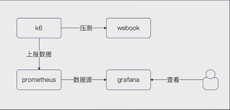

# k6

k6 + Prometheus + Grafana



## K6 的特点和优势
- **简单易用**：整体上来说，唯一的难点就是要学会编写 JS 脚本，不过如果你掌握了 GO 之后，去学JS，照着K6的例子来写，也不会特别复杂。
- **多协议支持**：包括但不限于 HTTP、WebSocket、gRPC。不过在实践中用 HTTP 比较多。
- **分布式测试支持**：具备分布式测试的能力，可通过多个实例协同工作，模拟更真实的负载。也就是说，具备构造高并发测试请求的能力。
- **现代化的性能测试指标**：提供丰富的性能测试指标，包括响应时间、请求成功率、虚拟用户数等，也可以自定义一些指标。
- **适用于持续集成和自动化**：可与持续集成工具集成，方便在构建管道中执行性能测试。

所以这里用K6，是因为k6集成 Grafana 比较方便，并且功能更加强大，可以设计更加复杂的测试用例。


## k6 测试脚本
在使用 k6 的时候，最为关键的一步就是要**学会写 k6 的测试脚本**.

```javascript
import http from 'k6/http';

const url = "http://localhost:8080/hello"

export default function () {
    const data = {name: "John"}
    const okStatus = http.expectedStatuses(200)

    http.post(url, JSON.stringify(data), {
        headers: {
            'Content-Type': 'application/json',
        },
        responseCallback: okStatus
    })
}
```

## 执行测试命令 k6
在根目录下的子目录下，**先设置Prometheus的接收数据的地址**。
export K6_PROMETHEUS_RW_SERVER_URL='http://localhost:9090/api/v1/write

**而后运行 k6 run**，里面传入几个参数：
- -o experimental-prometheus-rw：将压测数据直接写入到 Prometheus 中。
- --duration 30s：也就是执行30秒。
- --vus 10：设置十个虚拟用户，也就是模拟10个虚拟用户在使用。也可以使用范围的形式，例如10-100，就是从10逐步增长到100。

基本上掌握了这几个参数就可以了，还有的参数，可以通过运行 k6 help run 来仔细查看。


```javascript
// 声明K6运行结果投递到响应的prometheus上
// $Env:K6_PROMETHEUS_RW_SERVER_URL="http://localhost:9090/api/v1/write"
// export K6_PROMETHEUS_RW_SERVER_URL="http://localhost:9090/api/v1/write"
// 这个是可选的，指定上报哪些数据
// $Env:K6_PROMETHEUS_RW_TREND_STATS="p(50),p(90),p(95),p(99),min,max"
// export K6_PROMETHEUS_RW_TREND_STATS="p(50),p(90),p(95),p(99),min,max"
// 运行
// k6 run -o experimental-prometheus-rw --duration 30s --vus 100 k6.js
```