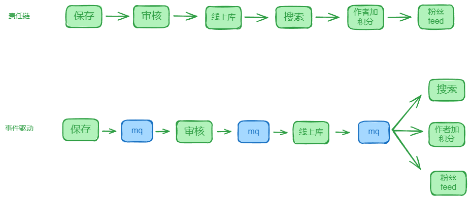
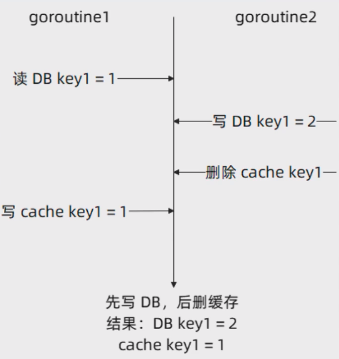

# 设计原则

## 面向接口编程
所谓的面向接口编程，是指：

**如果你使用到了别的类型，那么用的一定是接口。**

这里有一些争议的点：
- 如果我当下只有一个实现，我需要定义一个接口吗？
- - **答案是，如果你预期你负责维护这段代码的时间内，有可能有新的实现，那你就要定义接口。**
- 什么时候不用接口，而是用具体实现呢？
- - **答案是你依赖于具体实现细节的时候**。例如说在 Repository 里面，正常读写数据都是用接口方法，但是如果你要依赖于这个 Repository 内部控制缓存预加载的特性，那么就应该用具体的实现。


### 为什么面向接口编程

面向接口编程核心就是为了：**扩展性**。

也就是，在使用接口的时候，我们可以根据需要随时切换不同的实现，而不需要修改已有的代码。

除此以外，面向接口编程还是别的优秀实践的基础：
- 是坚持开闭原则的基础。
- 是装饰器模式等设计模式的基础。
- ...

总之，你可以认为，当你熟练掌握并且能够深刻领会到面向接口编程的意义的时候，就是你成为高级工程师的时候。


## 依赖注入

依赖注入也是我们一直秉持的原则。

所谓的依赖注入就是：
- **如果 A 用到了 B，那么 B 一定是 A 的字段。**
- **如果 B 是 A 的字段，那么 B 一定是在构造 A 的时候从外部传入进来的。**

如果叠加面向接口编程，那么就再加上一条：
- **如果 A 用到了 B，那么 B 一定是一个接口**

也就是，在初始化 A 的时候，传入 B 的一个具体实现。


## 单一职责原则

单一职责原则，就是指一个接口只干一件事（或者有联系的几件事）。

**最直观的说法，就是你的接口不能有很多方法，应该只有寥寥几个方法，而且这些方法应该是类似的。**

在我们课程里体现这个原则的，就是搜索服务里面，我们拆成了两个接口，一个负责数据同步，一个负责查询。


## CQRS
CQRS，命令-查询分离。

换一句更加通俗易懂的话来说，**就是读写方法，你要分散到不同的接口里面去**。

前面的搜索服务拆分成两个接口，也可以看做是这种原则的体现。

并且，读写方法分离到不同的接口之后，还有一个最大的好处就是：分别治理。

比如我们课程里面讨论过的，读写接口降级写接口；限流的时候可以读接口设置更高的阈值，写接口设置更加低的阈值。


## 开闭原则

开闭原则强调的是：对修改闭合，对扩展开放。

**简单来说，就是如果在发生变更的时候，已有的实现不需要改，而是考虑提供新的实现。**

最典型的例子就是我们使用装饰器来为已有功能添加新的功能。


## 超前设计，但是不超前实现
很多时候，为了方便后期维护和扩展，**在设计的时候，需要超前设计。**

第一条要记住的就是：**超前设计，但是不需要超前实现。**

也就是说，即便你预期到将来会有很多变化，但是你不要提早解决应对这些变化，而是通过留出接口的形式来保留应对的可能性。


## 异步优先

正如之前在课程里面讲到的，很多人的思维是优先考虑同步调用。

但是在系统规模开始变大，稳定性、可用性和性能这些问题日益突出的时候，你需要**转变为异步优先**。

具体来说，就是**不到逼不得已，不用同步调用**。

也就是但凡能够借助 Kafka 等来完成的事情，就不要借助同步的 gRPC 或者 HTTP 来完成。


# 设计模式

## 装饰器模式

装饰器模式**主要用于在已有实现的基础上，无侵入式地增加新的功能**。


## 洋葱模式

**装饰器模式不断叠加，就可以变成洋葱模式。**

洋葱模式的特性就是不断在已有的基础上叠加新功能。

一般来说，越是靠近洋葱内核，就越是核心的功能。

洋葱模式完美坚持了开闭原则，并且扩展性极佳。大部分中间件的设计核心都是一个洋葱。

最为典型的应用就是你可以在初始化 sms 的时候，在最基本的具体实现上，叠加装饰器，加上可观测性、容错和鉴权之类的功能。


## Builder 模式

我们课程中，Builder 模式在构建各种 middlware 和插件的时候用得多。

**Builder 模式一般用于构造复杂得对象，或者说用来构造你预期会有很多变化的对象。**

Builder 模式一般会结合链式调用来设计，也就是说 Builder 模式会返回 Builder 本身，知道完成整个构建。


## Option 模式：接口实现

最典型的就是在 gRPC 里面，大量使用了 Option 模式。

Option 模式通常有两种实现方式：
1. 接口实现
2. 函数式实现

总结：**有点复杂但是又不是特别复杂的，就用 Option；特别复杂的就用 Builder。**


## 适配器模式

**适配器模式一般将一个接口适配到另外一个接口。**

适配器常用于，版本升级的时候还要保持向后兼容性的场景中。

```go
package main

import "context"

type MyServiceV1 interface {
	Handle(req any)
}

type MyServiceV2 interface {
	Handle(ctx context.Context, req any)
}

type v2Tov1 struct {
	v2 MyServiceV2
}

func (v *v2Tov1) Handle(req any) {
	v.v2.Handle(context.Background(), req)
}

type MyServiceInvoker struct {
	v1 MyServiceV1
}

func NewMyServiceInvoker(V1 MyServiceV1) MyServiceInvoker {
	return MyServiceInvoker{
		v1: V1,
    }
}

func main() {
	v2 := MyServiceV2{}
	NewMyServiceInvoker(&v2Tov1{
		v2: v2,
    })
}
```


## 组合模式

**组合模式是 Go 本身就支持的，也就是我们惯用的组合语法而已。**

```go
type SMSGRPCServer struct {
	svc service.Service
	smsv1.UnimplementedSMSServiceServer
}
```

如上例：是我们利用组合模式来实现的装饰器，这样可以控制住我们只需要装饰必要的方法，而别的方法我们可以不管。

这样就可以保持 gRPC 接口向后兼容。即便是 Protobuf 增加了新的方法，这里依旧可以编译通过。


## 责任链模式

最为典型的责任链模式，是 Gin 里面接入 middleware 的方式。

可以认为，**每一个 middleware 都是责任链上的一环。**




# DDD

## Service
具体来说，在 DDD 里面，业务逻辑正常应该放在两个地方：
- **Service**
- **Domain Object（领域对象）**

而在课程里面，Domain Object 上都没有什么方法，所以真正的业务逻辑是放在了 Service 里面。

注意在增删改查为主的项目里面，Service 这个部分是没有什么内容的。


## Domain Object

**在 DDD 的理论中，Domain Object 会用来承担很多的业务逻辑。**

但是在互联网这一类的应用中，因为业务逻辑大部分都是存取数据，或者调用下游接口，所以 Domain Object很多时候都难以用上。

在这种情况下，Domain Object 大部分时候只能看做是一个数据载体。

不过在实践中，还是应该尽量考虑把逻辑挪到 Domain Object 上。


## Repository

总结来说：一切和存储有关的事情，都在 Repository 上处理。

在我们课程中，Repository 最常见的做法就是集成了 DAO 和 Cache 操作。具体来说，Repository 要负责：
- 调用 DAO 和 Cache 的方法来读写数据。
- 负责解决缓存一致性的问题。
- 解决缓存预加载的问题。
- 如果在存储层面也有降级等治理策略，也可以在 Repository 层面上解决。

**对于一个简单的增删改查应用来说，大部分代码应该都在 Repository 里面。**

注意一点：大部分情况下，缓存与否，怎么缓存是技术问题，不是业务逻辑。


### Repository 和 DAO、Cache
可以明确说，在 DDD 里面没有规定一定要有 DAO 或者 Cache。

**你可以将 DAO 和 Cache 看成是我们实现 Repository 的一种方式。**

在很多公司里面，Repository之下并没有明显的 DAO 和 Cache 的概念。


# 缓存策略

## 缓存一致性的解决方案

严格来说，这个方案并没有解决缓存一致性的问题。

删除缓存是指，**先更新数据库，再删除缓存**。

这种策略能够有效缓存一致性的问题。



如上图，就是在极端情况下，它还是有一致性的问题。

但是这种极端情况比较少见，因为正常来说读 DB 到回写缓存是很快的，明显比写 DB 到删除 Key 快。

在用户缓存里面，插入数据之后，我们就是删了缓存的数据。


## 分页接口缓存第一页

分页接口是很不好设计缓存的。

但是有一种策略还比较好用：**缓存第一页的结果**。

这种缓存策略是建立在第一页会被频繁访问，因此缓存第一页效果会很明显。

这个策略可以叠加业务相关预加载，也就是将第一页的前几条数据的详情也放到缓存里面。


## 业务相关预加载

在 article 里面我们提到过一种缓存策略，即业务相关的预加载。

也就是在分页查询的时候，可以尝试把第一页的 N 条的详细内容提前缓存起来。

**这种是基于用户行为的业务相关的预加载。**

简单来说，就是如果你可以在一个接口里面预期用户很快会访问下一个接口，那么你就可以提前将下一个接口的数据加载出来。
（可以将数据提前到CDN，BFF等）


## 应用启动预加载

业务相关的预加载算是一种很巧妙的做法。

**在实践中更加常用的是应用启动的时候预加载缓存。**

正常启动的时候预加载都是预加载本地缓存，如果是 Redis 缓存，那么不需要每个节点启动的时候都加载，只需要加载一次就可以。


## 本地缓存-Redis-DB 三级结构

在一些对性能要求比较苛刻的应用中，会考虑使用本地缓存 - Redis 和 DB 的三级结构。

你要注意读写顺序：
- **读：先读本地缓存，再读 Redis，最后写 DB。**
- **写：先写 DB，再写本地缓存，最后写 Redis。**

注意写顺序，先写本地缓存，后写 Redis 是因为本地缓存操作几乎不可能失败。
（可结合哈希类的负载均衡算法，确保每个用户的缓存固定在一个节点）


## 本地缓存作为 Redis 缓存的备份

本地缓存的缺陷命中率比较低，以及占用内存比较多，所有轻易不要使用本地缓存。

另外一种**策略就是将本地缓存用作 Redis 缓存的备份。**

也就是正常是走 Redis，再走 DB。

但是 Redis 崩溃之后，可以先走本地缓存，再走 DB。

等 Redis 恢复了再切换回去。


# 微服务

微服务架构的知识点比较多并且比较杂，而且在实践中应用起来非常强调因地制宜。

首先第一个要强调的点就是：微服务架构是可以建立在 HTTP 协议上的。

或者说**你可以利用HTTP接口来搭建微服务**。它一样是微服务架构。


## 服务注册与发现

服务注册与发现的要点在于：
- 注册中心的基本模型
- 服务注册的步骤
- 服务退出的步骤
- 容错

在面试中，你一定要额外强调容错。

**容错和核心就是客户端应该尽可能利用本地缓存的服务节点数据，并且在发现一个服务端节点不可用之后，要将它挪走，后续还要考虑挪回来。**


## 负载均衡

负载均衡的本质是找到一个最适合处理请求的节点，大多数时候就是那个你预期会最快返回响应的节点。

负载均衡中，各种静态算法都算是比较基础的内容，需要掌握。

而后比较关键的点是在负载均衡算法里面考虑**动态调整权重**。动态调整的过程中，你要考虑调整的步长（也就是增加幅度或者减少幅度），权重的上下限。

后面你掌握了熔断、限流和降级等治理措施之后，可以在负载均衡这里进一步整合，设计更加复杂的负载均衡策略。


## 熔断

熔断是经常使用的一种服务治理手段。**它是一种保护机制，用于防止微服务架构中的级联故障**。

简单来说，熔断就是一旦触发了，直接拒绝了所有的请求。所以服务端如果有什么负载引起的性能问题，那么负载会快速降低。

熔断是一种比较彻底的治理手段。


## 降级

降级本质上和熔断差不多。如果说熔断是直接拒绝全部请求，那么**降级就是尽可能返回一个响应**。

这个响应可以直接是一个提前配置好的默认响应，也可以是走某些特定的快路径。


## 限流

**限流是指值允许服务端处理特定数量的请求，超过这个限制的请求会被服务器拒绝。**

常见的限流算法包括：固定窗口、滑动窗口、令牌桶、漏桶等算法。

当然，这里说的拒绝是比较笼统的说法，比如说你可以考虑转异步，后续再处理；也可以直接返回特定的错误；或者直接转发给别的节点。


### 微服务案例：缓存与降级/限流结合

在面试中很好用的一个例子，**就是在触发降级或者限流的时候，只查询缓存**。


### 微服务案例：结合负载均衡

**熔断、限流和降级三个策略是可以结合负载均衡在一起使用的。**

也就是触发了熔断/限流/降级的时候，针对当次请求，可以让客户端直接换节点。

还可以将这个节点的权重降低到极低，这样后续的请求就不会再选择这个节点。


### 微服务案例：客户端治理

在 sms 里面我们深入讨论过客户端治理。

在客户端治理里面，核心是识别第三方服务有没有问题。其次是判定服务端出现问题之后可以：
- 同步转异步。
- 更换节点。
- 返回默认值。

### 微服务案例：故障判定

可以看到，实施服务治理手段的前提就是要判定有没有出现故障。

那么课程里面我们讲过：
- **基于超时的判定。**
- **基于响应时间的判定。**
- **基于错误响应的判定。**
- **基于服务端返回的错误码的判定。**

而在服务端本身：
- **可以检测自身的硬件资源。**
- **可以监控自身的性能数据。**
