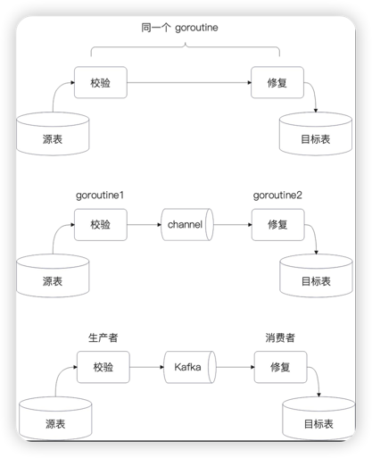
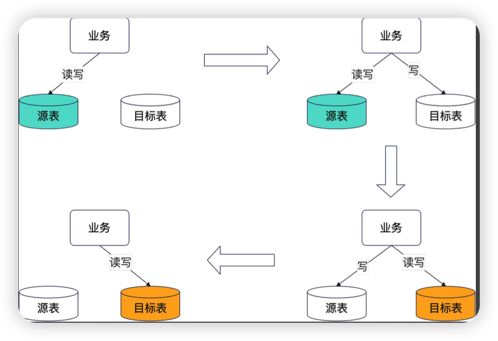

## 为什么要迁移
在经过微服务化之后，我们的代码已经拆除去了，但是还在共享一个数据库（逻辑上和物理上都是一个数据库）.

在微服务的理论里面，有一个广泛认同的观点：**即某个微服务的数据也要单独存储的**。因此，正常在微服务化之后，我们还要把所有的数据都分离了，单独存储。


### 异构数据迁移

这里说的异构数据迁移，**是指原表和目标表的结构不一样**。

显然，**如果数据库都不一样，也算是异构数据迁移**。比如说 MYSQL 迁移到 MongoDB，一般数据量大了又懒得分库分表，就可能用 MongoDB。

异构数据迁移会更加复杂，因为数据转换 - 完整性校验都很麻烦。
- **数据转换**：最麻烦的就是不同数据类型转换可能出现不兼容的问题，如果是数字，还可能会有精度问题。还有长度限制，则有溢出问题。
- **完整性校验**：也就是常见的外间约束，数据之间的业务关系等，都很难验证。


### 停机迁移
最自然的想法就是：
- **停下应用；**
- **从老库中导出数据；**
- **倒入数据到新库中；**

这个方案在中小型应用中很常见，或者额在一些不重要的业务中也很常见。

缺陷：应用停下来了
如果数据量很多，那么不管是导出，还是导入数据，都非常慢。这就是意味着你的应用要停很久。


## 不停机迁移方案

在停机迁移方案里面，我们知道停机迁移对用户体验的伤害是非常大的，所以基本上在现实中，核心应用都是不停机迁移数据。

这意味着：
- **当你一遍迁移数据，一边又有新数据产生，或者老数据被更新了。**
- **当你迁移数据的时候，你不能对数据库造成太大的压力，否则会影响应用的正常运行。**

### 不停机迁移的难点
整个不停机的迁移的核心难点就是：**数据始终处于变动之中**。


### 不停机迁移的四个阶段
- **第一阶段：业务读写源表。** 在这个阶段你要完成目标表的数据初始化过程。
- **第二阶段：双写阶段，以源表为准**。在这个阶段数据会被双写到源表和目标表中，并且读是读源表，如果数据不一致，也是以源表的数据为准。
- **第三阶段：双写阶段，以目标表为准**。在这个阶段，数据也是保持双写，但是读以目标表为准，并且修复数据的时候，是以目标表为准。
- **第四阶段：业务读写目标表**。

### 不停机迁移的具体步骤
- 创建目标表。
- 用源表的数据初始化目标表。
- 执行一次检验，并且修复数据，此时用源表修复目标表数据。
- **业务代码开启双写，此时读源表，并且先写源表，数据以源表为准。**
- 开启增量校验和数据修复，保持一段时间。
- **切换双写顺序，此时读目标表，并且先写目标表，数据以目标表为准。**
- 继续保持增量校验和数据修复。
- **切换为目标表单写，读写都只操作目标表。**

### 数据导出工具：mysqldump
#### 导出数据
```shell
mysqldump -h 127.0.0.1 --port 13306 -u root -p webook interactives user_like_bizs collections > intr.sql
```

**-h：指定了 host**。不指定的话，它会默认是本地安装，于是会尝试找 /tmp/mysql.sock，就会出错。

#### 创建新的数据库，并导入到目标表
```mysql
create database if not exists webook_intr;
use webook_intr;
source intr.sql;
```

### 异构数据初始化
异构数据是不能直接导入的，更加复杂一些。基本思路有：手动写一个程序，而后批量读取源库的数据。
- 转化为SQL，而后导入 SQL 到目标表。
- 直接在代码中利用 ORM 插入。

这两种方式中，第二种方式要慢一些。两种思路都可以开启很多个goroutine 来并发完成，例如：
- **表内拆分，每个goroutine负责一部分数据**。例如说三个 goroutine，可以分别负责 ID%3 为0，1，2的数据。
- **每个 goroutine 负责不同的表。**

前面两个措施也可以混合使用，注意 goroutine 的数量，防止影响线上的应用。

### 校验逻辑
#### 全量校验与修复

在初始化了目标中的数据之后，你可以考虑执行一次全量校验和修复。

注意这个时候你还没有开启双写，这个步骤是可选的，也就是你并不是一定要在这个时候就执行全量校验和修复。

**这个步骤是为了在开启双写之前，尽可能减少两个库之间的数据不一致性。**

ps：这个全量校验和修复的程序本身就可以用来导出和导入数据。

#### 全量校验和修复的难点
全量校验从方案上来说，**就只是一条一条数据对比。**

那么问题就来了，**要是数据量特别大，怎么尽快完成全量校验与修复。**

例如书，在一些大厂的核心业务里面，一个逻辑表（它多半已经被分库分表了）的数据可能有数十亿条，这意味着：如果你希望在一天内完成数据校验与修复，那么你的 QPS 就需要过完。

**答案就是：并发**，并且是尽可能地提高并发度，而后要在这个过程中，保护住源表和目标表。

#### 校验和修复：一把梭？还是两把梭？
整个全量检验和修复可以看做是两个步骤：校验，如果发现不一致，则修复。

因此从形态上来说，有以下几种比较典型的做法：
- **校验如果发现数据不一致，那么立刻修复**。这些都是同一个 goroutine 来执行的。
- **校验如果发现数据不一致，那么立刻交给另外一个 goroutine 去修复**。可以引入 channel，也可以不引入channel。
- **校验如果发现数据不一致，那么发送消息到消息队列中，消费者消费了再去修复数据。**


#### 校验方案
这里我们采用 Kafka 的方案，因为我们要保护着目标表。

也就是通过 Kafka 解耦和削峰，**我们可以很容易控制住消费者的消费速率，也就间接控制住了目标表的写入速率。**

当然，从面试的角度上说，也是 Kafka 方案更加高级一点。

#### 校验的基本思路
校验的基本思路就是：**从源表中取出数据，再根据主键去目标表中找出对应的数据，比较所有的字段是否相等。**

初看起来这是一个非常简单的东西，但是这里有很多坑：
- 数据库的类型有很多，**都能转成 Go 语言类型吗？**
- 转成的 Go 语言类型，**都是可比较的吗？**
- 浮点数之类的，从数据库读出来之后，转为 Go 的数据类型，**精度有没有损失？还能不能比较？**

这些都牵涉到，我们究竟怎么查询数据，用什么 Go 语言类型来接收数据，以及如何比较。

#### 方案选型
现在我们面临一个选择：
- 我们**针对每一张表**都写一个 DAO 查询方法，而后写一个比对方法。
- 我们**借助范型**来写一个通用的查询方法，而后要求实体实现具体的比较方法。
- 我们**直接用最底层的[]byte**来接收任何数据，而后直接比较[]byte。

事实上，第二种方案和第三种方案都是可以的。方案一不行之处在于如果实践中有很多的表，你一个个写过去是要命的。

要是你能够拿到实体定义（也就是表结构对应的模型），那么可以考虑方案二。如果不能，那么我们考虑方案三。


#### 异构数据的校验逻辑
异构数据库下，会面临几个问题：
- 从源表中查出数据之后，**没有办法利用主键去目标表中找到数据。**
- - 解决思路是可以考虑用唯一索引、外键等来去目标表中查找对应的数据。
- **源表中的字段有一部分被丢弃了，🈶或者目标表中有新的数据**，并且这些数据是根据源表中的某些数据计算出来的。
- - 这种情况下只能定制校验逻辑，无法使用一个通用的校验逻辑。


#### 校验的调度时机
如果你的全量校验会持续很长时间，那么你就可以考虑挑一个合适的时机来执行全量校验，基本的思路有：
- **在业务低峰期运行**。也就是设置一个定时任务，设置时间到业务低峰期。
- **动态判定当前负载，负载高则挂起，负载低则继续。**


### 双写
在经过第一次的全量校验和修复之后，你可以开启双写。
又或者你直接开启双写，跳过第一次的全量校验和修复。
**双写是指：你在写入源库的时候，也要同时写入到目标库。**

难点在于：**同时涉及到两个库，所以无法使用数据库事物。**

#### 双写 + 流量切换


事实上不仅仅是双写，而是要进一步考虑流量调度，读写哪个数据源的问题。

因此，我们在双写**这个方案里一并考虑流量调度的问题。**

总结来说，也就是四个模式：
- SRC_ONLY：也就是第一阶段。
- SRC_FIRST：也就是第二阶段。
- DST_FIRST：第三阶段。
- DST_ONLY：第四阶段。

##### 双写的实现思路
既然要双写，问题来了，怎么双写？
- 思路一：**直接修改DAO层，里面直接操作两个DB**，异构数据库只能这么写。
- 思路二：能不能**利用 GORM HOOK 或者 Callback**机制，当出现了增删改的时候，执行双写？
- 思路三： 在 GORM 底层有一个接口，**ConnPool，也可以考虑利用这个接口。**

思路一的缺陷：
- **侵入式修改**，比较容易引入 BUG。
- 修改的代码很多，**容易遗漏。**

思路二：不可行
**Hook需要定义在结构体之上，一个个定义过去，就比较麻烦。**

所以我们可能想到可以用 Callback，但是实际上这里基本搞不了。

因为 Callback 接收了一个 DB，而这个 DB 是固定的。
所以我们无法达成思路一里面的动态切换。

思路三：
借助 ConnPool 的思路很高级，要求对 GORM 的底层框架有很深的理解，并且要求有比较高的代码技巧。
ConnPool是对 GORM 的底层接口，**他是直接和数据库打交道的出口。**
与之类似的，是 GORM 还暴露了事物控制的接口，这样我们还可以同步控制在事物内部的双写。
还可以使用 ConnPool 实现读写分离的操作。


### 增量校验与修复
增量校验与修复是指：老数据就不需要了，新修改的数据会被再次验证和修复。
该过程主要针对双写过程，防止双写中间出现了问题。
**增量校验在第二阶段和第三阶段都可以运行。**

#### 我怎么知道双写，写了哪些数据？
增量校验针对的是新修改的数据，那么我怎么知道哪些数据是新修改的呢？
- 思路一：**能不能利用之前前面的双写 ConnPool 实现**，找到已经修改过的数据？
- 思路二：**能不能利用 utime**，找到某个时间点之后的，就认为是新修改的数据？
- 思路三：**能不能考虑利用 Mysql 更加底层的机制**，例如说 binlog 机制？基本死里就是通过 binlog 知道被修改过的数据。

思路一：
做不到，或者说说起来很难。
举例来说，如果执行的是一个 UPDATE 语句：
UPDATE xx SET xxx WHERE a = 1;
那么你并不能知道，数据库里 a = 1 的行数有多少。

理论上的做法就是通过 SQL 语法树分析提取出来 WHERE 部分，而后转为一个 SELECT 语句，找出受影响的行。


思路二：
大部分的公司在设计表结构的时候都会有一个规范，要求有一个代表更新时间的列。

也就是说，当我们执行增量校验的时候，**就是从数据库中轮训出来近期的数据，而后执行校验。**

**utime上面如果没有一个独立的索引，那么在查询的时候就会特别慢。**

那么，根据 utime 和 sleepInterval 的组合就可以直接实现全量校验和增量校验
- utime = 0 并且 sleepInterval <= 0：那么就是全量校验，并且在数据校验完毕之后，就直接退出。
- utime = 0 并且 sleepInterval > 0：那么就是全量校验，并且在全量校验之后还会继续搞增量校验。
- utime是近期某个时间点，并且 sleepInterval > 0 ：就是校验近期修改的数据，并且后续保持增量校验。

#### 增量校验与修复的并发问题
在开启了增量校验之后，存在一些并发问题。

也就是说，目标哭实际上有两个在写：
- 业务写数据
- 修复写数据

显然，**有可能出现修复写操作直接把业务写操作覆盖了。**

怎么办？
**答案是不需要办，等再次更新到这条数据，或者开启全量（增量）校验，就可以了。**


#### 增量校验和全量校验是可以并行的
增量校验和全量校验可以一起运行的，只是大多数时候没有太大必要。

比如说在使用了 Canal 的增量校验开启的时候，同时开启全量校验。

**如果计算机资源足够多，你可以一直开着全量校验，一遍又一遍重复。**

这个时候也是有并发问题的，但是没有关系，只要不断重复校验和修复，就不怕。

### 优化性能：开 goroutine
正常来说，全量校验和修复在大规模集群上，跑一轮就要几天，都是很正常的事情，但是有些手段可以优化性能。
- 按照表来开启 goroutine，比如说一张表就是一个 goroutine 负责
- 如果表本身数据很多，那么可以考虑利用步长。例如一台机器负责校验一个表，这台机器上开启 10 个 goroutine，分别负责尾号0、1、2、3、4、5、6、7、8、9、0 Id 的数据。

**一般来说，校验数据和修复的性能瓶颈通常出在数据库上，而不在我们的程序上。**


### 解决数据迁移中的数据库性能瓶颈
首先得明确一个前提：就是双写的流量，数据库必须要能撑住。

在这之后，数据库还需要考虑的流量，就只剩下校验的**读流量**和修复的**读写流量**。

思路有一些：
- **在业务低峰期开启更多 goroutine 来校验，但是业务高峰期就不开那么多 goroutine，甚至直接停掉。**
- **专门准备一个新的从库，就用来服务数据迁移**。一般不会采用这种办法，代价太高。除非是核心中的核心数据库，不然的话不会搞这个。


### 主从集群对数据迁移的影响以及优化策略
要注意：如果校验最新数据，**那么应该读主库**，因为从库是有延迟的。

但是大多数时候，主库光是服务写请求就已经负载很高了。在这种情况下，还要服务校验和修复过程的读请求，可以说是雪上加霜了。

所以可以用一种优化策略：**校验的时候，先读从库。如果从库数据不一致，再读主库校验一遍。**

但是修复的时候是没有办法的，只能走主库。

前面我们使用 Kafka 就已经起到了削峰效果。如果要进一步保护主库，那么就可以考虑接入数据库限流。

流量录制与重放