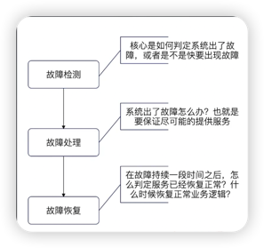
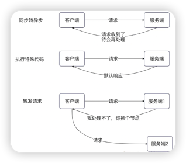
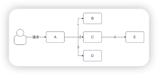
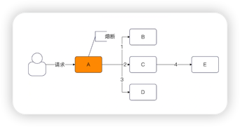
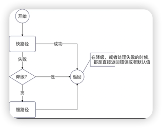
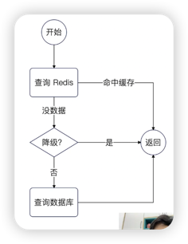
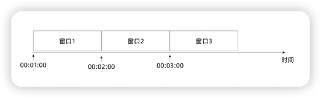
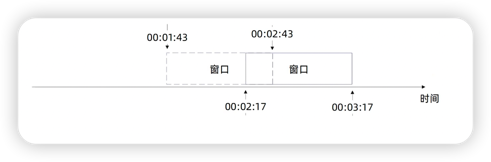

### 服务治理

服务治理是一个非常宽泛的问题，涵盖了：
- **熔断、限流和降级**
- **超时控制**
- **隔离**
- **分组和路由**
- **优雅退出**

其中熔断、限流和降级是听过最多的服务治理措施，也就是实践中和面试中的高频面试点。

应当说，**微服务架构里面要想把亮点面出来，就必须要有一整套的，从前端到后端的服务治理方案。**

#### 服务治理：怎么解决系统故障

整体来说，你可以认为，服务治理讨论的就是：
- **怎么保证系统不会出现故障**？或者说，尽量让系统少出现故障。
- 万一系统出现了故障：
- - 怎么尽快发现出现故障了？
- - 怎么处理出现的故障？
- - 怎么从故障中恢复过来？或者说，怎么退出故障处理机制，恢复正常的业务流程？

这也就是整个故障处理的理论：
- **故障检测**
- **故障处理**
- **故障恢复**

在这三个的基础上，有些(人)时候还会在故障检测之前加上一个故障预防的阶段，比如说将限流认定为是故障预防，毕竟限流是不管有没有问题，到了阈值就开始限流。

#### 故障检测

总体来说故障检测的思路就是两条：
- **静态检测**：也就是压根不管服务的真实状态，而是根据压测结果、研发人员的历史经验，设定一些阈值，触发了阈值就认为服务出现了（或者快要出现）问题。
- **动态监测**：也就是可以根据服务所在节点的**硬件信息，服务本身的信息**（如响应时间、错误率）等来判断。

#### 故障处理

故障处理实际上能玩的花样也不多。

主要方式有：
- **同步转移异步**：也就是把请求记录下来，后续再处理。
- **执行特殊代码**：对于熔断、限流来说，就是返回 error；对于降级来说，可能返回默认值，或者执行一个快路径。
- **请求转发**：也就是当前节点不能处理该请求，就会把请求转到别的节点。这个过程如果通过客户端来配合，实现更加简单。

所以你可以看到，所谓的熔断、限流、降级本质上其实都是一回事。

#### 故障恢复

故障恢复的要点在于：
- **该如何确定我的服务是否已经恢复正常了？**
- - 固定时间等待：例如说一分钟，就认为已经恢复了。
- - 实时计算：也就是根据故障检测的算法，实时计算服务端节点的状态。
- - 试探法：尝试处理请求，而后根据处理结果，来确定系统是否已经恢复。
- **避免抖动**：也就是退出故障处理流程的时候，不要立刻引起系统再次出发故障，基本思路就是：
- - 结合试探法来逐步放开流量，也可以叫做灰度。

故障恢复如果处理不好，很容易导致出现系统一会好，一会崩溃的情况。

##### 故障恢复：几乎通用的策略

大部分时候，故障恢复都可以采用试探 + 逐步放开流量的方式来进行。这里以系统发生故障之后所有请求都返回默认值为例。

- 首先，触发故障修复（返回了默认值）之后，每隔一段时间就试探性的处理一个请求。
- 如果该请求被正常处理了，那么就加大流量；如果没有被正常处理，那么就继续返回默认值的状态。
- 在逐步加大流量的过程中，如果要是请求没有被正常处理，那么就减少流量，或者再次进入到返回默认值的状态。
- 在不断加大流量之后，直到 100% 的流量都被正常处理了。

这种政策，**可以参考随机数 + 阈值的流量控制方案。只要需要根据处理结果实时调整阈值就可以。**

#### 微服务流量放大与雪崩

这算是一个额外的知识点。
也就是在微服务架构里面，有一个很重要的特性，**就是一个单一请求在微服务处理过程中，会产生非常多的服务调用。**

如下图，当后端收到一个请求之后，在整个过程中总共发起了四个微服务查询。

因此可以看出，一旦请求本身流量增长了一倍，那么整个系统的实际负载增长，不止一倍。

所以我们在做微服务治理的时候，也要考虑这个问题。例如说通过限流、熔断等措施防止服务雪崩，或者说风险扩大。

#### 具体措施：熔断
熔断是经常使用的一种服务治理手段。**他是一种保护机制，用于防止微服务框架中的级联故障**。

所谓联机故障，就是因为一个节点出错之后，导致别的节点跟着出错。本质上是因为微服务架构流量放大引起的。

如上图，当流量突然增大的时候，节点A直接熔断之后，就可以避免B、C和D崩溃，也进一步避免了E崩溃。

限流和降级也能达成类似效果。

##### 熔断的要点

熔断的要点在于：
- **如何判定服务是否需要熔断了**？这就是我们之前说的**故障检测**，也就是可以考虑静态态监测和动态监测
- **熔断之后怎么办**？ 大多数时候都是返回**特定错误**。
- **怎么从熔断之中恢复过来**？也一样是试探请求+逐步放开流量。

熔断还有一种说法，是说熔断处于三种状态：
- 开放状态：也就是所有的请求都返回特定错误；
- 闭合状态：也就是说所有请求都被正常处理；
- 半开放状态：一部分请求被正常处理，一部分请求直接返回错误。

而本质上，半开放状态处于恢复过程中的状态。

#### 降级
降级的本质上和熔断差不多。如果说熔断是直接拒绝全部请求，那么**降级就是尽可能返回一个响应**。这个响应可以直接是一个提前配置好的默认响应，也可以是走某些特定的快路径。

如上图是一个示例，在大多数的业务场景中，有些时候会有两条路径：

- 快路径耗费资源少，计算快；
- 慢路径耗费资源多，计算慢。

正常都是先执行快路径，再执行慢路径。在降级之后，可以只执行快路径，而不执行慢路径。

##### 降级的典型例子：缓存降级方案

一个非常好的面试方案就是将降级用于查询过程。

在正常时候，我们都是先查询 Redis。如果 Redis 查询不到，则查询数据库，再诙谐缓存。

但是**在降级的时候，我们只查询 Redis。Redis 查询到了，则直接返回数据；如果 Redis 查询不到，则直接返回错误，或者兜底的默认值**。

这种策略的优势在于：
- **应用本身的负载会快速降低**。因为只查询 Redis，所以会很快，因此请求会被快速处理完毕，就能腾出资源来；
- **能撑住极高并发**。整个瓶颈变成了 Redis。注意，即便缓存命中率极高，但是少数的数据库查询也会极大拖累并发；
- **能保住数据库**。例如说 Redis 本身有问题，或者玩过有问题，在这种策略下，数据库不会被请求压垮。

##### 降级：跨服务降级

还有一种做法，**是跨服务降级**。

例如说在用户服务上，有增删改和查询服务。那么在资源不足的时候，就可以考虑将增删改停掉，全力支持查询服务。

类似地剋做的更加高级：
- 在集群层面上，如果服务器资源不足，那么就将边缘业务停掉，腾出服务器资源给核心服务。
- 如果是读服务和写服务分组部署的模式，那么也可以将写服务停掉，调用资源支持读服务；
- 同一个节点上部署不同服务，可以按照重要性从不重要到重要，逐步停掉服务，直到腾出足够的资源。

#### 限流

限流是指，当判定系统已经无法处理更多的请求的时候，就执行限流策略。

目前大多数时候，**我们讨论的限流都是静态限流。也就是提前设置好一个限流阈值，如果超过这个阈值，那么就开启限流，正常来说就是拒绝这个请求，即返回特定的错误**。

##### 限流：被限流的请求怎么办？
很少有人会仔细讨论限流中被限流的请求该怎么办。
实际上也可以考虑：
- 同步转异步：也就是被限流的请求临时保存下来，后续再处理。
- 执行特殊代码：例如直接返回默认值；
- 转发请求：例如通知客户端换一个节点重试；

从这个能看出来，**限流、熔断和降级之间的界限不是很分明。**

##### 限流对象：针对什么限流？

在实践中，你可以考虑：
- **针对单机限流，或者针对集群限流**；
- **针对整个应用限流**，也可以针对应用提供的某个服务限流。例如说可以整个用户服务限流，也可以是用户服务内部的某个接口（例如说更新信息）限流；
- **针对业务对象限流**：这个就可以完全根据你的业务特征来设置，非常灵活。
- - 针对用户限流：例如说 VIP 用户不限流，但是普通用户限流
- - 针对 IP 限流

#### 限流算法
限流里面，讨论比较多的就是限流算法。

限流算法具体来说，有：
- **计数器**
- **固定窗口**
- **滑动窗口**
- **令牌桶**
- **漏桶**

这些算法用起来的效果都差不多，实践中可以随表选择一个算法实现。

##### 计算器算法

计数器很简单：**收到请求的时候，计数器 +1；返回响应的时候，计数器 -1**。

这个算法就是保持在任何时刻，整个系统里面只有固定个请求正在被处理。
实现最简单的一种算法。
个人认为，该算法效果强力，并且不会比后面的算法差。

##### 固定窗口
固定窗口的原理很简单：**将时间切成一个个窗口，确保每个窗口内的请求数量没有超过阈值**。

##### 滑动窗口
滑动窗口算法原理也很简单。**你可以认为自始自终只有一个窗口，这个窗口就是从当前时间往前回溯窗口大小一段时间，在这个窗口内，只能处理固定数量的请求。**

在这种机制下，整个窗口看起来就是仿佛在滑动一下：

##### 固定窗口和滑动窗口对比

大体上来说，**可以认为固定窗口没有滑动窗口常用**。固定窗口的流量不如滑动窗口均匀。例如说在窗口1的最后 0.1 秒来了100 个请求，并且在窗口2的第0.1秒也来了100个请求。那么就相当于在0.2秒的时间内，来了两百个请求，而且都要处理。
滑动窗口则没有这个问题。

##### 令牌桶
令牌桶算法要点：
- **有一个人按一定的速率发令牌**
- 令牌会被放到一个桶里
- 每一个请求从桶里面拿到一个令牌
- 拿到令牌得到请求就会被处理
- 没有拿到令牌的请求就会：
- - 直接被拒绝
- - 阻塞直到拿到令牌或者超时

##### 漏桶
漏桶算法要点：
- **有一个人按照一定速率发令牌**
- 每一个请求拿到一个令牌
- 拿到令牌的请求会被处理
- 没有拿到令牌的请求就会：
- - 直接被拒绝
- - 阻塞直到拿到令牌或者超时

##### 令牌桶和漏桶对比

令牌桶：
- 允许积压，也就是说可以攒一些令牌，那么**突发流量来的时候，有更多的请求可以拿到令牌；**

漏桶：
- 没有积压，绝对均匀。漏桶可以做到，不管什么时候，**放过去请求的速率都是均匀的**；

大多数时候，我们其实不在意这种差别，所以你可以无脑选。