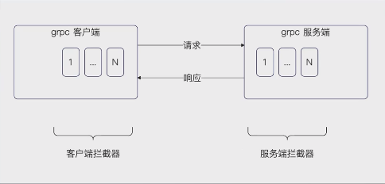
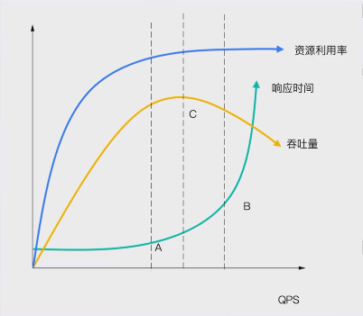
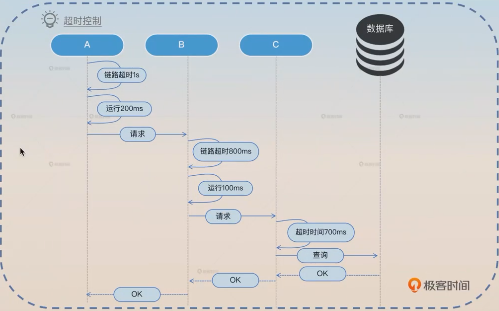

### 服务治理

服务治理是一个非常宽泛的问题，涵盖了：
- **熔断、限流和降级**
- **超时控制**
- **隔离**
- **分组和路由**
- **优雅退出**

其中熔断、限流和降级是听过最多的服务治理措施，也就是实践中和面试中的高频面试点。

应当说，**微服务架构里面要想把亮点面出来，就必须要有一整套的，从前端到后端的服务治理方案。**


#### 服务治理：怎么解决系统故障

整体来说，你可以认为，服务治理讨论的就是：
- **怎么保证系统不会出现故障**？或者说，尽量让系统少出现故障。
- 万一系统出现了故障：
- - 怎么尽快发现出现故障了？
- - 怎么处理出现的故障？
- - 怎么从故障中恢复过来？或者说，怎么退出故障处理机制，恢复正常的业务流程？

这也就是整个故障处理的理论：
- **故障检测**
- **故障处理**
- **故障恢复**

在这三个的基础上，有些(人)时候还会在故障检测之前加上一个故障预防的阶段，比如说将限流认定为是故障预防，毕竟限流是不管有没有问题，到了阈值就开始限流。


#### 故障检测

总体来说故障检测的思路就是两条：
- **静态检测**：也就是压根不管服务的真实状态，而是根据压测结果、研发人员的历史经验，设定一些阈值，触发了阈值就认为服务出现了（或者快要出现）问题。
- **动态监测**：也就是可以根据服务所在节点的**硬件信息，服务本身的信息**（如响应时间、错误率）等来判断。


#### 故障处理

故障处理实际上能玩的花样也不多。

主要方式有：
- **同步转移异步**：也就是把请求记录下来，后续再处理。
- **执行特殊代码**：对于熔断、限流来说，就是返回 error；对于降级来说，可能返回默认值，或者执行一个快路径。
- **请求转发**：也就是当前节点不能处理该请求，就会把请求转到别的节点。这个过程如果通过客户端来配合，实现更加简单。


所以你可以看到，所谓的熔断、限流、降级本质上其实都是一回事。


#### 故障恢复

故障恢复的要点在于：
- **该如何确定我的服务是否已经恢复正常了？**
- - 固定时间等待：例如说一分钟，就认为已经恢复了。
- - 实时计算：也就是根据故障检测的算法，实时计算服务端节点的状态。
- - 试探法：尝试处理请求，而后根据处理结果，来确定系统是否已经恢复。
- **避免抖动**：也就是退出故障处理流程的时候，不要立刻引起系统再次出发故障，基本思路就是：
- - 结合试探法来逐步放开流量，也可以叫做灰度。

故障恢复如果处理不好，很容易导致出现系统一会好，一会崩溃的情况。


##### 故障恢复：几乎通用的策略

大部分时候，故障恢复都可以采用试探 + 逐步放开流量的方式来进行。这里以系统发生故障之后所有请求都返回默认值为例。

- 首先，触发故障修复（返回了默认值）之后，每隔一段时间就试探性的处理一个请求。
- 如果该请求被正常处理了，那么就加大流量；如果没有被正常处理，那么就继续返回默认值的状态。
- 在逐步加大流量的过程中，如果要是请求没有被正常处理，那么就减少流量，或者再次进入到返回默认值的状态。
- 在不断加大流量之后，直到 100% 的流量都被正常处理了。

这种政策，**可以参考随机数 + 阈值的流量控制方案。只要需要根据处理结果实时调整阈值就可以。**


#### 微服务流量放大与雪崩

这算是一个额外的知识点。
也就是在微服务架构里面，有一个很重要的特性，**就是一个单一请求在微服务处理过程中，会产生非常多的服务调用。**

如下图，当后端收到一个请求之后，在整个过程中总共发起了四个微服务查询。


因此可以看出，一旦请求本身流量增长了一倍，那么整个系统的实际负载增长，不止一倍。

所以我们在做微服务治理的时候，也要考虑这个问题。例如说通过限流、熔断等措施防止服务雪崩，或者说风险扩大。


#### 具体措施：熔断
熔断是经常使用的一种服务治理手段。**他是一种保护机制，用于防止微服务框架中的级联故障**。

所谓联机故障，就是因为一个节点出错之后，导致别的节点跟着出错。本质上是因为微服务架构流量放大引起的。


如上图，当流量突然增大的时候，节点A直接熔断之后，就可以避免B、C和D崩溃，也进一步避免了E崩溃。

限流和降级也能达成类似效果。

##### 熔断的要点

熔断的要点在于：
- **如何判定服务是否需要熔断了**？这就是我们之前说的**故障检测**，也就是可以考虑静态态监测和动态监测
- **熔断之后怎么办**？ 大多数时候都是返回**特定错误**。
- **怎么从熔断之中恢复过来**？也一样是试探请求+逐步放开流量。

熔断还有一种说法，是说熔断处于三种状态：
- 开放状态：也就是所有的请求都返回特定错误；
- 闭合状态：也就是说所有请求都被正常处理；
- 半开放状态：一部分请求被正常处理，一部分请求直接返回错误。

而本质上，半开放状态处于恢复过程中的状态。

#### 降级
降级的本质上和熔断差不多。如果说熔断是直接拒绝全部请求，那么**降级就是尽可能返回一个响应**。这个响应可以直接是一个提前配置好的默认响应，也可以是走某些特定的快路径。


如上图是一个示例，在大多数的业务场景中，有些时候会有两条路径：

- 快路径耗费资源少，计算快；
- 慢路径耗费资源多，计算慢。

正常都是先执行快路径，再执行慢路径。在降级之后，可以只执行快路径，而不执行慢路径。

##### 降级的典型例子：缓存降级方案

一个非常好的面试方案就是将降级用于查询过程。

在正常时候，我们都是先查询 Redis。如果 Redis 查询不到，则查询数据库，再诙谐缓存。

但是**在降级的时候，我们只查询 Redis。Redis 查询到了，则直接返回数据；如果 Redis 查询不到，则直接返回错误，或者兜底的默认值**。

这种策略的优势在于：
- **应用本身的负载会快速降低**。因为只查询 Redis，所以会很快，因此请求会被快速处理完毕，就能腾出资源来；
- **能撑住极高并发**。整个瓶颈变成了 Redis。注意，即便缓存命中率极高，但是少数的数据库查询也会极大拖累并发；
- **能保住数据库**。例如说 Redis 本身有问题，或者玩过有问题，在这种策略下，数据库不会被请求压垮。


##### 降级：跨服务降级

还有一种做法，**是跨服务降级**。

例如说在用户服务上，有增删改和查询服务。那么在资源不足的时候，就可以考虑将增删改停掉，全力支持查询服务。

类似地剋做的更加高级：
- 在集群层面上，如果服务器资源不足，那么就将边缘业务停掉，腾出服务器资源给核心服务。
- 如果是读服务和写服务分组部署的模式，那么也可以将写服务停掉，调用资源支持读服务；
- 同一个节点上部署不同服务，可以按照重要性从不重要到重要，逐步停掉服务，直到腾出足够的资源。


#### 限流

限流是指，当判定系统已经无法处理更多的请求的时候，就执行限流策略。

目前大多数时候，**我们讨论的限流都是静态限流。也就是提前设置好一个限流阈值，如果超过这个阈值，那么就开启限流，正常来说就是拒绝这个请求，即返回特定的错误**。


##### 限流：被限流的请求怎么办？
很少有人会仔细讨论限流中被限流的请求该怎么办。
实际上也可以考虑：
- 同步转异步：也就是被限流的请求临时保存下来，后续再处理。
- 执行特殊代码：例如直接返回默认值；
- 转发请求：例如通知客户端换一个节点重试；

从这个能看出来，**限流、熔断和降级之间的界限不是很分明。**


##### 限流对象：针对什么限流？

在实践中，你可以考虑：
- **针对单机限流，或者针对集群限流**；
- **针对整个应用限流**，也可以针对应用提供的某个服务限流。例如说可以整个用户服务限流，也可以是用户服务内部的某个接口（例如说更新信息）限流；
- **针对业务对象限流**：这个就可以完全根据你的业务特征来设置，非常灵活。
- - 针对用户限流：例如说 VIP 用户不限流，但是普通用户限流
- - 针对 IP 限流

#### 限流算法
限流里面，讨论比较多的就是限流算法。

限流算法具体来说，有：
- **计数器**
- **固定窗口**
- **滑动窗口**
- **令牌桶**
- **漏桶**

这些算法用起来的效果都差不多，实践中可以随表选择一个算法实现。

##### 计算器算法

计数器很简单：**收到请求的时候，计数器 +1；返回响应的时候，计数器 -1**。

这个算法就是保持在任何时刻，整个系统里面只有固定个请求正在被处理。
实现最简单的一种算法。
个人认为，该算法效果强力，并且不会比后面的算法差。


##### 固定窗口
固定窗口的原理很简单：**将时间切成一个个窗口，确保每个窗口内的请求数量没有超过阈值**。


##### 滑动窗口
滑动窗口算法原理也很简单。**你可以认为自始自终只有一个窗口，这个窗口就是从当前时间往前回溯窗口大小一段时间，在这个窗口内，只能处理固定数量的请求。**

在这种机制下，整个窗口看起来就是仿佛在滑动一下：


##### 固定窗口和滑动窗口对比

大体上来说，**可以认为固定窗口没有滑动窗口常用**。固定窗口的流量不如滑动窗口均匀。例如说在窗口1的最后 0.1 秒来了100 个请求，并且在窗口2的第0.1秒也来了100个请求。那么就相当于在0.2秒的时间内，来了两百个请求，而且都要处理。
滑动窗口则没有这个问题。


##### 令牌桶
令牌桶算法要点：
- **有一个人按一定的速率发令牌**
- 令牌会被放到一个桶里
- 每一个请求从桶里面拿到一个令牌
- 拿到令牌得到请求就会被处理
- 没有拿到令牌的请求就会：
- - 直接被拒绝
- - 阻塞直到拿到令牌或者超时


##### 漏桶
漏桶算法要点：
- **有一个人按照一定速率发令牌**
- 每一个请求拿到一个令牌
- 拿到令牌的请求会被处理
- 没有拿到令牌的请求就会：
- - 直接被拒绝
- - 阻塞直到拿到令牌或者超时


##### 令牌桶和漏桶对比

令牌桶：
- 允许积压，也就是说可以攒一些令牌，那么**突发流量来的时候，有更多的请求可以拿到令牌；**

漏桶：
- 没有积压，绝对均匀。漏桶可以做到，不管什么时候，**放过去请求的速率都是均匀的**；

大多数时候，我们其实不在意这种差别，所以你可以无脑选。


#### 总结：熔断、限流、降级用哪个？
- 如果你希望即便出现了各种故障，但是服务也要**尽可能保持可用，那么应该使用降级**；
- 如果你希望服务**尽快从故障中恢复过来，那么应该选用熔断**；
- 如果你希望**至少有一部分请求能够被正确处理，那么应该选用限流**；

如果从个人的使用频率来说，是限流 > 降级 > 熔断。**熔断本身的破坏性也很强，所以比较少用**。


#### 总结：动态判定

正如之前多次学到的，你完全可以根据实际业务、服务信息来判定服务的状态。

**可以是硬件指标**：例如 CPU、内存、磁盘 IO。
**可以是服务指标**：例如响应时间，超时率等。

而后，一旦判定服务已经出现故障了，就可以从熔断、限流、降级里面挑一个来执行。
最后回复过程，同样可以综合硬件指标和服务指标，来判定是加大流量还是降低流量。

ps：实践中，很少采用这种复杂的策略，也就是出去宣讲、汇报、晋升答辩、面试的时候会吹嘘这种策略。


### 在 gRPC 中接入服务治理

#### gRPC 中的接入点
类似于在 web 中接入限流，在 gRPC 中接入熔断、限流和降级，也是利用 middleware 之类的机制。

在 gRPC 中，**类似的机制被叫做 Interceptor**。

具体来说，gRPC 的 Interceptor 分成：
- 客户端的 Interceptor
- 服务端的 Interceptor

大部分情况下，我们熔断、限流和降级都是在服务端处理的，所以我们会用到服务端的 Interceptor。




#### 服务端 Interceptor

服务端的 Interceptor 用法并不是很难。

在服务端中，**处理普通的 RPC 调用的拦截器叫做 UnaryServerInterceptor**。

它**本质上是一个函数类型**，接收参数：
- **ctx**：常见的参数，一般来说和链路有关的数据可以从这里拿出来。
- **req**：客户端发过来的请求，具体类型和调用的服务有关。
- **info**：有两个字段。其中 Server 代表的是你的服务实现，FullMethod 是调用的目标服务。
- **handler**：处理请求的处理器。

```go
// server 端
server := grpc.NewServer(grpc.ChainUnaryInterceptor(first))

var first grpc.UnaryServerInterceptor = func(ctx context.Context, req any, info *grpc.UnaryServerInfo, handler grpc.UnaryHandler) (resp any, err error) {
	log.Println("这是第一个前")
	resp, err = handler(ctx, req)
	log.Println("这是第一个后")
	return resp, err
}

// client 端
var clientFitst grpc.UnaryClientInterceptor = func(ctx context.Context, method string, req, reply any, cc *grpc.ClientConn, invoker grpc.UnaryInvoker, opts ...grpc.CallOption) error {
log.Println("这是第一个前")
err := invoker(ctx, method, req, reply, cc, opts...)
log.Println("这是第一个后")
return err
}

opts := []grpc.DialOption{
grpc.WithResolvers(bd),
grpc.WithTransportCredentials(insecure.NewCredentials()),
grpc.WithChainUnaryInterceptor(clientFitst),
}
cc, err := grpc.NewClient("etcd:///service/user", opts...)

```


### 总结：限流阈值该如何确定？-- 压测

在实践中，很多时候我们都面临一个问题，即限流阈值怎么确定？

标准答案是根据压测结果来确定。面试也是最好回答这个答案。



如上图是一个压测的图像。你可以考虑的点有几个：
- **A 是性能最好的点**。A 之前 QPS 虽然在上升，但是响应时间稳定不变。在这个时候利用率也在提升，所以选择 A 你可以得到最好的性能和较好的资源利用率。
- **B 是系统快要崩溃的临界点**。很多人会选择这个点作为限流的阈值。这个点响应时间已经比较长了，但是系统还能撑住。选择这个点意味着能撑住更高的并发，但是性能不是最好的，吞吐量也不是最高的。
- **C 是吞吐量最高的点**。实际上，有些时候你压测出来的 B 和 C 可能对应到同一个 QPS 的值。选择这个点作为限流阈值，你可以得到最好的吞吐量。


### 总结：限流阈值该如何确定？-- 其他手段

但是实践中，很多公司是没有办法做压测的，或者说因为业务快速上线的原因，来不及做压测。在这种情况下，可以考虑：
- **已经上线的接口可以利用现有的观测数据。**
- **参考类似接口的阈值。**
- **手动计算**。可以通过分析带代码来确定阈值，例如一个数据库查询是 10ms，整个请求有两次数据库操作，那么对应的数据库耗时就是 20ms，而整个实例是4核 CPU，那么阈值就是 1000/2*4 = 200.

一般来说，你都要在这些估计的阈值上预留一些空间，比如说上调一些。


### gRPC 中超时控制

正常来说，**你可以发起调用的时候创建一个带超时的 ctx 实例，就可以控制住这一次调用的超时时间。**

```go
package main

import (
	"context"
	"github.com/stretchr/testify/require"
	"google.golang.org/grpc"
	"google.golang.org/grpc/credentials/insecure"
	"testing"
	"time"
	intrv1 "webook/api/proto/gen/intr/v1"
)

func TestGRPCClient(t *testing.T) {
	cc, err := grpc.NewClient("localhost:8090", grpc.WithTransportCredentials(insecure.NewCredentials()))
	require.NoError(t, err)
	client := intrv1.NewInteractiveServiceClient(cc)

	// 1s 超时
	ctx, cancel := context.WithTimeout(context.Background(), time.Second)
	defer cancel()
	res, err := client.IncrReadCnt(ctx, &intrv1.IncrReadCntRequest{
		Biz:   "test",
		BizId: 123,
	})
	t.Log(res)

	resp, err := client.Get(context.Background(), &intrv1.GetRequest{
		Biz:   "test",
		BizId: 123,
		Uid:   345,
	})
	require.NoError(t, err)
	t.Log(resp)
}

```


#### gRPC 与链路超时控制

从理论上来说，链路超时控制分成两种：
- **单次调用超时控制**
- **链路超时控制**

所谓链路超时控制，就是指在整个请求从收到到返回响应，都被同一个超时时间控制住。



如上图，是一个 A 调用 B，B 调用 C 的简单例子。

可以注意到，B 的超时时间是 A 设置的超时时间减去已经消耗的时间，也叫做剩余超时时间。

#### gRPC 自带链路超时

gRPC 有一个非常好的特性，就是它自带了链路超时控制。

也就是说，**你不需要做任何事情，在服务端的收到请求的时候，ctx里面就是剩余超时时间.**


### 总结：如何确定超时时间？

理论上来说，**超时时间是从用户体验的角度来确定的**。

也就是说，产品经理跟你说，这个接口用户最多能等多久，那么你的整条链路的超时时间就是多久。但是一些产品经理可能没有办法给你这个数值，那么这种情况下，你要确定超时时间，一九有一些方式：
- **根据接口的观测数据来确定**。例如说，你调用的接口的 999 线是 1s，那么你就可以把超时时间设置为 1s。
- **手动计算**。类似在确定限流阈值的那样，手动计算。
在实践中，首页的接口响应时间应该在 100ms 以内 -- 这意味着接口不能做任何复杂的操作。而在用户体验设计中，1s 是一个比较关键的结点，因为超过 1s，用户就有很明显的卡顿或者等待的感觉了。

grpc 调用 http 服务时传递超时信息：
借用gin的 handlerFunc 使用 ctx.GetHeader("Timeout")


### grpc 中接入可观测性

#### 日志
之前我们已经在 Web、ORM 等各个地方接入了可观测性，**现在我们需要在微服务部分接入可观测性的组件。**

首先我们可以考虑接入日志，同样也是利用 Interceptor 来实现。
- **客户端信息**：尽量获取客户端的应用名字，IP + 端口（或者实例ID）。
- **调用情况**：调用的方法名字，如果在 DEBUG 环境下，可以考虑记录请求和响应。
- **执行情况**：是否有 error，如果有错误码，那么错误码是什么。

```go
package logging

import (
	"context"
	"fmt"
	"google.golang.org/grpc"
	"google.golang.org/grpc/codes"
	"google.golang.org/grpc/status"
	"runtime"
	"time"
	"webook/pkg/grpcx/interceptors"
	"webook/pkg/logger"
)

type InterceptorBuilder struct {
	L logger.LoggerV1
	interceptors.Builder
}

func (i *InterceptorBuilder) Build() grpc.UnaryServerInterceptor {
	return func(ctx context.Context, req any, info *grpc.UnaryServerInfo, handler grpc.UnaryHandler) (resp any, err error) {
		start := time.Now()
		var event = "normal"
		defer func() {
			duration := time.Since(start)
			if rec := recover(); rec != nil {
				switch recType := rec.(type) {
				case error:
					err = recType
				default:
					err = fmt.Errorf("%v", rec)
				}
				stack := make([]byte, 4096)
				stack = stack[:runtime.Stack(stack, true)]
				event = "recover"
				err = status.New(codes.Internal, "panic, err "+err.Error()).Err()
			}
			fields := []logger.Field{
				logger.Int64("cost", duration.Milliseconds()),
				logger.String("type", "unary"),
				logger.String("method", info.FullMethod),
				logger.String("event", event),
				// 这个部分需要你的客户端配合，
				// 你需要知道是哪一个业务调用过来的
				// 是哪个业务哪个结点过来的
				logger.String("peer", i.PeerName(ctx)),
				logger.String("peer_ip", i.PeerIP(ctx)),
			}
			if err != nil {
				st, _ := status.FromError(err)
				fields = append(fields, logger.String("code", st.Code().String()), logger.String("code_msg", st.Message()))
			}
			i.L.Debug("RPC请求", fields...)
		}()
		resp, err = handler(ctx, req)

		return
	}
}

```


#### trace

**记录的信息其实和log差不多**

```go
package trace

import (
	"context"
	"github.com/go-kratos/kratos/v2/errors"
	"go.opentelemetry.io/otel"
	"go.opentelemetry.io/otel/attribute"
	"go.opentelemetry.io/otel/codes"
	"go.opentelemetry.io/otel/propagation"
	semconv "go.opentelemetry.io/otel/semconv/v1.26.0"
	"go.opentelemetry.io/otel/trace"
	"google.golang.org/grpc"
	"google.golang.org/grpc/metadata"
	"webook/pkg/grpcx/interceptors"
)

type InterceptorBuilder struct {
	tracer     trace.Tracer
	propagator propagation.TextMapPropagator
	interceptors.Builder
}

func (b *InterceptorBuilder) BuildClient() grpc.UnaryClientInterceptor {
	propagator := b.propagator
	if propagator == nil {
		// 这个是全局
		propagator = otel.GetTextMapPropagator()
	}
	tracer := b.tracer
	if tracer == nil {
		tracer = otel.Tracer("webook/pkg/grpcx/interceptors/trace")
	}
	attrs := []attribute.KeyValue{
		semconv.RPCSystemKey.String("grpc"),
		attribute.Key("rpc.grpc.kind").String("unary"),
		attribute.Key("rpc.component").String("server"),
	}
	return func(ctx context.Context, method string, req, reply any, cc *grpc.ClientConn, invoker grpc.UnaryInvoker, opts ...grpc.CallOption) (err error) {
		ctx, span := tracer.Start(ctx, method, trace.WithSpanKind(trace.SpanKindClient), trace.WithAttributes(attrs...))
		defer span.End()
		defer func() {
			if err != nil {
				span.RecordError(err)
				if e := errors.FromError(err); e != nil {
					span.SetAttributes(semconv.RPCGRPCStatusCodeKey.Int64(int64(e.Code)))
				}
				span.SetStatus(codes.Error, err.Error())
			} else {
				span.SetStatus(codes.Ok, "OK")
			}
		}()

		// inject 过程
		// 要把跟 trace 有关的链路元数据，传递到服务端
		ctx = inject(ctx, propagator)
		err = invoker(ctx, method, req, reply, cc, opts...)
		return err
	}
}

func (b *InterceptorBuilder) BuildServer() grpc.UnaryServerInterceptor {
	propagator := b.propagator
	if propagator == nil {
		// 这个是全局
		propagator = otel.GetTextMapPropagator()
	}
	tracer := b.tracer
	if tracer == nil {
		tracer = otel.Tracer("webook/pkg/grpcx/interceptors/trace")
	}
	attrs := []attribute.KeyValue{
		semconv.RPCSystemKey.String("grpc"),
		attribute.Key("rpc.grpc.kind").String("unary"),
		attribute.Key("rpc.component").String("server"),
	}
	return func(ctx context.Context, req interface{}, info *grpc.UnaryServerInfo, handler grpc.UnaryHandler) (resp interface{}, err error) {
		ctx = extract(ctx, propagator)
		ctx, span := tracer.Start(
			ctx, info.FullMethod,
			trace.WithSpanKind(trace.SpanKindServer),
			trace.WithAttributes(attrs...),
		)
		defer span.End()
		span.SetAttributes(
			semconv.RPCMethodKey.String(info.FullMethod),
			attribute.Key("net.peer.name").String(b.PeerName(ctx)),
			attribute.Key("net.peer.ip").String(b.PeerIP(ctx)),
		)
		defer func() {
			if err != nil {
				span.RecordError(err)
			} else {
				span.SetStatus(codes.Ok, "ok")
			}
		}()
		resp, err = handler(ctx, req)
		return
	}
}

func inject(ctx context.Context, propagators propagation.TextMapPropagator) context.Context {
	// 先看 ctx 里面有没有元数据
	md, ok := metadata.FromIncomingContext(ctx)
	if !ok {
		md = metadata.New(map[string]string{})
	}
	// 把元数据放回去 ctx，具体怎么放，放什么内容，由 propagator 决定
	propagators.Inject(ctx, GRPCHeaderCarrier(md))
	return metadata.NewOutgoingContext(ctx, md)
}

func extract(ctx context.Context, p propagation.TextMapPropagator) context.Context {
	// 拿到客户端过来的链路元数据
	// "md": map[string]string
	md, ok := metadata.FromIncomingContext(ctx)
	if !ok {
		md = metadata.New(map[string]string{})
	}
	// 把这个 md 注入到 ctx 中
	// 根据你采用 zipkin 或者 jeager，他的注入方式不同
	return p.Extract(ctx, GRPCHeaderCarrier(md))

}

type GRPCHeaderCarrier metadata.MD

func (g GRPCHeaderCarrier) Get(key string) string {
	vals := metadata.MD(g).Get(key)
	if len(vals) > 0 {
		return vals[0]
	}
	return ""
}

func (g GRPCHeaderCarrier) Set(key string, value string) {
	metadata.MD(g).Set(key, value)
}

func (g GRPCHeaderCarrier) Keys() []string {
	keys := make([]string, 0, len(g))
	for k := range metadata.MD(g) {
		keys = append(keys, k)
	}
	return keys
}

```


#### prometheus


