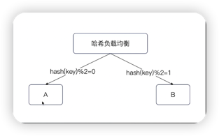

### 负载均衡
服务注册与发现，已经解决了“**有哪些可用服务实例**”的问题，现在就要讨论下一个问题：
**这么多可用服务实例，我该把请求发给谁？**

这一步，我们直觉就想到关键字：负载均衡。

事实上负载均衡是手段而不是目的。因此从目的上来说，我们其实不需要搞什么负载均衡，我们的目的就死活把请求转发给“最合适”处理这个请求的节点。最合适处理意味着：
- 如果这个请求需要很多内存，那么将它转发给内存多的节点。
- 如果这个请求是 CPU 密集的，那么将它转发给 CPU 比较空闲的请求。
- ......

显然，在大多数时候，我们会希望将请求转发给“能够最快返回响应”的那个节点。


### 负载均衡的本质
在这种情况，你应该理解到：负载均衡本质上是一个简化模型。

也就是说，如果我们的目标是挑选出那个最合适的节点，我们就得建设一个标准。

而这个标准，被简化为“负载”。换言之，**我们认为负载最轻的就是最合适的**。

而考虑到所有的节点都提供同等的服务，那么你每次挑选负载最轻的节点，**就造成所有的节点负载是大致均衡的**。


### 负载均衡算法：静态负载均衡算法
因此，你可以进一步总结出来，所谓的负载均衡算法，实际上就是尝试着在所有的节点里，挑选出一个最好的目标节点。

大体上来说，负载均衡有两大类：静态负载均衡算法和动态负载均衡算法。

**静态负载均衡的思路是完全不管节点的实际负载，而是依靠统计学来保证负载是均衡的。**

也就是说，只要发的请求足够多，这些节点就大概率负载是均衡的。

主要有：**轮训、加权轮训、随机、加权随机、哈希、一致性哈希**。

所以，你可以认为静态负载均衡算法就是摆烂，反正都算不出实际的负载，我索性直接不算了。


#### 轮训
轮训算法的效果很不错，而且应该是应用最广泛的负载均衡算法了。

**轮训的思路非常简单，也就是一个个节点的轮流过去。**

虽然轮训的算法很简单（实现也很简单），但是它效果很不错。应该说，绝大多数情况下，直接使用轮训算法不会有任何问题。

但是轮训本身有两个假设：
- 所有服务器的处理能力是一样的。
- 所有请求所需的资源也是一样的。

而在实践中，这两个假设，尤其是第二个假设，并不成立。**因此轮训用多了，难免会遇到偶发性的负载不均衡问题**。

典型例子就是某个节点收到一个大请求，直接把自己打爆了。


#### 加权轮询
加权轮询是对轮询的一个改进。

算法大体上还是轮询，但是不再是一个请求一个节点这样轮询，**而是按照权重来轮询。权重多的多分到几个请求，权重小的就少几个请求。**

权重大多数时候都是代表了服务端节点的处理能力（重要性、优先级等）。

还有一些比较罕见的情况是在多活的场景下，同机房、同城的节点会有更高的权重。

**如何获得权重？**
在注册中心模型下，权重基本上是通过注册中心来传递的。

**也就是每一个服务端节点在启动的时候会把自己的权重信息也注册进去**。
客户端在服务发现的过程中，就能获得对应的权重信息。


**普通加权轮询的权限**
普通加权轮询，有一个缺陷：**权重高的服务端节点会连续收到多个请求**


#### 平滑的加权轮询
加权轮询算法是在加权算法的基础上，引入了一个 currentWeight（当前权重）的概念。每次选中一个节点之后，就降低 currentWeight。

于是一个节点就有两个权重：初始权重和当前权重。整个算法的步骤：
- **计算所有的初始权重的和，也就是总权重。**
- **每一个节点，都让自己的当前权重加上初始权重。**
- **选出当前权重最大的节点，发送请求。**
- **将选出的节点的当前权重减去总权重。**


#### 随机
随机算法比轮询还要简单，就是随表挑一个。

从实现的角度来说，就是生成一个随机数，**利用随机数除以总节点数量，得到的余数就是节点的下标。**

随机算法有两个假设：
- 所有服务器的处理能力是一样的。
- 所有请求所需的资源也是一样的。

并且，随机算法还认为在请求数量足够多的情况下，节点负载是均衡的。

当然，**如果你特别倒霉，也是会遇到负载不均衡的问题。**


#### 加权随机
加权随机类似于加权轮询，给每一个节点一个权重。

加权随机的基本思路：
- **计算一个总权重 T。**
- **生成一个随机数 r。**
- **r 落到总权重的哪个区间，就选择哪个节点。**


加权随机没有平滑的加权随机版本，因为用不上。


#### 哈希
哈希算法核心就是根据业务特征来计算一个哈希值，而后除以节点总数，就是目标节点。

你可以将哈希和随机结合一起看，**那么随机算法就是用随机数，而哈希算法就是用业务特征来计算哈希值。**

所谓的业务特征，可以是：
- 业务 ID
- 外键
- 唯一索引
- ......

跟你的业务是密切相关的。


#### 加权哈希算法
加权哈希算法也类似于加权随机算法。

**用哈希值代替了随机数，就变成了加权哈希算法**


#### 一致性哈希
一致性哈希算法是哈希算法的改进，引入了一个类似环。

同样的计算哈希值，但是哈希值和节点的关系是：**哈希值落在某一个区间内，会被特定的一个节点处理。**

**因此优势就是当增加节点或者减少节点的时候，只有一部分请求命中的节点会发生变化。**


### 动态负载均衡算法
动态负载均衡算法核心在于：尝试实时计算节点的负载。

而在实践中，我们其实也不知道怎么定量计算一个节点的负载，所以动态负载均衡算法也只能根据各自的理解，选择一些指标。

常见的有：
- **最少连接数**
- **最少活跃度**
- **最快响应**


#### 最少连接数
基本的想法就是：**如果一个节点上的负载很高，那么连到这个节点的连接数量肯定很多。**

每次挑选节点的时候，客户端看看自己这边所有的候选节点的连接数有多少，然后**挑选最少连接数的节点。**

但是这里面有缺陷：如果是在连接多路复用的情况下，也就是一个连接可以同时被多个请求复用的时候，那么连接数少的，可能负载反而更高。

比如说服务端 A 上面十个连接，可能被100个请求复用，但是服务端C上面的十二个节点，可能只有50个请求复用。


#### 最少活跃数
活跃数是指正在被处理的请求数量。

很显然，活跃请求数还是比较准确的。

**客户端为每一个服务端节点维持一个活跃请求数计数，每次发请求的时候选择一个活跃数最低的节点。**


#### 最快响应时间
**简而言之：每次挑选曾经最快返回响应的节点。**

这个响应时间可以是：
- 平均响应时间
- 99 线
- 999 线

推荐平均响应时间或者99线


### 负载均衡总结
1. **要不要考虑服务器处理能力？**
- 轮询、随机、哈希、最少连接数、最少活跃数都没考虑
- 对于的加权版本，就可以用权重来代表服务器的处理能力。
2. **选择什么指标来表达服务器当前负载？**
- (加权)轮训、(加权)随机、哈希什么都没选，依赖于统计。
- 选择连接数、请求数、响应时间、错误率......**所以你可以随便选几个指标，然后设计自己的负载均衡算法。**
3. 是不是所有的请求所需的资源都是一样的？显然不是
- 大商家品类极多，大买家订单极多。
- **不考虑请求消耗资源的负载均衡，容易出现偶发性的打爆某一台实例的情况。**
4. 选什么负载均衡算法？**实践中遇事不决用轮训**，出了问题再说。

#### 权重效果
- 大多数时候我们都是**使用权重表达服务器的处理能力**，或者说重要性、优先级。
- 使用权重的算法都要考虑：
- - 某个实例的权重特别大，可能连续几次都会选中他，那么**要考虑平滑效果。**
- - **结合实际调用结果来调整权重**，例如实例如果返回了错误，那么就降低权重，反之就增加权重。
- - 一个实例的权重如果是动态调整的，那么就**要考虑上限和下限的问题**，尤其要考虑调整权重的过程中会不会导致权重变成0、最大值或者最小值。这三个值可能导致实例完全不被选中，或者一直被选中。


#### 微服务框架的局限性
前面我们聊到的三个动态负载均衡算法：最少连接数、最少活跃数、最快响应时间算法都是客户端来选择的。

但是客户端只知道自己这一边的情况，也就是：
- **客户端只知道自己和各个服务端节点的连接数。**
- **客户端只知道自己发过去，还没收到的响应的请求数。**
- **客户端只知道自己发过去的请求的响应时间，**

微服务框架不具备全局信息，两个客户端，自己从自己的视角选择最佳的节点，但是不能从全局的角度选择。

#### 设计自己的负载均衡算法
核心是**根据自己的业务特征来选取一些指标，来表达服务实例的负载。**
- 错误率等其他服务指标。
- CPU、IO、网络负载等硬件指标。

要想知道这些指标，除了客户端统计（有些客户端没法统计，例如每个实例的CPU），还有一些奇技淫巧：
- **服务端将指标的值写入注册中心**，注册中心通知客户端。
- 服务端**每次返回响应的时候，额外带上自己的指标**，如CPU利用率。
- **利用我们的可观测性平台**，从观测性平台获得数据。


### gRPC中默认的负载均衡算法：

grpc在默认情况下，**可以认为是没有负载均衡算法的，因为它永远只会选择第一个节点**。

这个第一个节点是你在 Resolver 里面解析出来的第一个节点。当然大多数时候，第一个节点是什么你一点都不关心，也没啥影响。


### gRPC 中使用 round_robin 算法
gRPC 提供了一些复杂均衡算法的实现，可以直接使用。

比如说**轮训算法，大多数时候你直接使用这个算法就足够了**。

要注意，这里是一个 gRPC 的垃圾设计，即传入 JSON 串。这里很容易写错。

```go
bd, err := resolver.NewBuilder(client)
	if err != nil {
		panic(err)
	}
opts := []grpc.DialOption{grpc.WithResolvers(bd), grpc.WithDefaultServiceConfig(`{"loadBalancingConfig":[{"round_robin":{}}]}`)}
```

round_robin 没有任何配置，所以后面就是一个 {}


### gRPC round_robin 算法实现
gRPC 的 round_robin **算法实现很简单，核心就是利用原子操作来更新候选节点的下表**。

```go
type rrPicker struct {
	// subConns is the snapshot of the roundrobin balancer when this picker was
	// created. The slice is immutable. Each Get() will do a round robin
	// selection from it and return the selected SubConn.
	subConns []balancer.SubConn
	next     uint32
}

func (p *rrPicker) Pick(balancer.PickInfo) (balancer.PickResult, error) {
	subConnsLen := uint32(len(p.subConns))
	nextIndex := atomic.AddUint32(&p.next, 1)

	sc := p.subConns[nextIndex%subConnsLen]
	return balancer.PickResult{SubConn: sc}, nil
}
```


### gRPC 中使用加权负载均衡算法
gRPC 本身就提供了加权负载均衡算法实现。

使用起来有两个地方需要修改：
- **匿名引入基于权重的负载均衡算法**，也就是初始化好这个算法。
- **在客户端启动的时候指定使用加权轮训算法。**

```go
import (
    _ "google.golang.org/grpc/balancer/weightedroundrobin"
)
opts := []grpc.DialOption{
grpc.WithResolvers(bd),
// 使用轮训负载均衡算法
grpc.WithDefaultServiceConfig(`{"loadBalancingConfig":[{"weighted_round_robin": {}}]}`),
}
```

#### 匿名引入的意义
匿名引入就是为了初始化好这个算法。

**也就是触发包中的 init 方法。**

这个在 Go 里面是非常常见的一种设计模式。即提供一个中间的注册方法，而后通过匿名引入来注册某个实现。

后续的所有使用的地方，都根据注册的名字来查找对应的实现。


#### 加权负载均衡算法原理
gRPC 中的加权均衡算法并不是我们之前讨论的服务端配置权重的加权算法。gRPC 是自己主动计算每个节点的权重。它会根据每个节点的 QPS、错误率来计算一个权重。

简单来说，**QPS 越高，权重越大；错误率越高，权重越低**。而后，利用 EDF 算法（Earliest Deadline First）从这些节点里面挑选出来一个。


### gRPC 中支持其他负载均衡算法
gRPC 自带的负载均衡算法你可以在 gRPC 下的子包 balancer 里面找到。
- grpclb：统一控制负载均衡的实现，用来集成其他负载均衡算法实现的，不需要用。
- leastrequest：最少请求数算法，实验特性，不要用。
- rls：集成了限流的负载均衡算法实现，也要配合其他负载均衡算法来使用，实验特性，不要用。
- roundrobin：轮询。
- weightedroundrobin：加权轮训。

总结就是，**除了 roundrobin 其他都没什么使用的必要。**


### 在 gRPC 中接入自己的负载均衡算法
有时候你需要根据业务特征来定制一些负载均衡算法，那么**就需要了解怎么接入自定义的算法**。

在 gRPC 里面，实现一个自定义算法，需要实现两个关键接口：
- PickerBuilder：它在 balancer.base 子包里面。
- Picker：在 balancer 子包下面。

```go
package wrr

import (
	"google.golang.org/grpc/balancer"
	"google.golang.org/grpc/balancer/base"
)

const name = "custom_wrr"

func init() {
	// NewBalancerBuilder 是帮我们把一个 Picker Builder 转化为一个 balancer builder
	balancer.Register(base.NewBalancerBuilder(name, &PickerBuilder{}, base.Config{HealthCheck: true}))
}

//传统版本的基于权重的负载均衡算法

type PickerBuilder struct {
}

func (p *PickerBuilder) Build(info base.PickerBuildInfo) balancer.Picker {
	var conns []*conn
	for sc, scInfo := range info.ReadySCs {
		cc := &conn{
			cc: sc,
		}

		md, ok := scInfo.Address.Metadata.(map[string]any)
		if ok {
			weightVal := md["weight"]
			weight, _ := weightVal.(float64)
			cc.weight = int(weight)
		}

		if cc.weight == 0 {
			cc.weight = 50
		}
		cc.currentWeight = cc.weight
		conns = append(conns, cc)

	}
	return &Picker{
		conns: conns,
	}
}

// Picker 这个才是真的执行负载均衡的地方
type Picker struct {
	conns []*conn
}

// Pick 在这里实现基于权重的负载均衡算法
func (p *Picker) Pick(info balancer.PickInfo) (balancer.PickResult, error) {
	if len(p.conns) == 0 {
		// 没有候选节点
		return balancer.PickResult{}, balancer.ErrNoSubConnAvailable
	}
	var total int
	var maxCC *conn
	// 计算当前权重
	for _, cc := range p.conns {
		total += cc.weight
		cc.currentWeight += cc.weight
		if maxCC == nil || cc.currentWeight > maxCC.currentWeight {
			maxCC = cc
		}
	}
	// 更新
	maxCC.currentWeight -= total
	// maxCC 就是挑出来的
	return balancer.PickResult{
		SubConn: maxCC.cc,
		Done: func(info balancer.DoneInfo) {
			// 很多动态算法，根据通用结果来调整权重，就在这里
		},
	}, nil
}

// conn 代表节点
type conn struct {
	// 权重
	weight        int
	currentWeight int

	// 真正的，grpc 里面的代表一个节点的表达
	cc balancer.SubConn
}

```

#### 自定义基于权重的负载均衡算法
这个算法的要点：
- **要在客户端这边拿到服务端节点的权重。**
- **利用权重实现一个平滑的基于权重的负载均衡算法。**

之前我们提到过，要在服务端到客户端之间传递元数据，那么就要利用到注册时候的 metadata 字段。

大部分时候，**每一个节点的权重信息都是从配置文件或者环境变量里面读取到的。**


### Kratos 中的负载均衡：默认算法

**在默认情况下，Kratos 使用的是平滑的加权轮训算法**。也就是，你不指定使用任何负载均衡算法的时候，用的就是这个。

实际上，在 Kratos 里面，负载均衡被进一步抽象（封装）为了一个 Selector 概念，允许你传入一些 filter 来过滤一些服务端节点。

这个 filter 功能你可以看做是分组/路由的统一抽象。


#### Kratos 中支持的负载均衡算法
- P2C（Pick of 2 Choices）：简单来说就是先随机选出两个节点，这两个节点需要满足一定的条件，而后再从这两个节点里面选出一个负载比较低的节点。
- Random：随机负载均衡算法。
- WRR：平滑肌的加权负载均衡算法。

**正常默认使用 WRR 就可以了。**


### go-zero 中的负载均衡
go-zero的默认负载均衡算法是 p2c。
并且，这个框架内部直接写死的
如果要修改，就必须**传入一个原生的grpc.WithDefaultServiceConfig 覆盖掉**。


### 总结
- 不管是自定义负载均衡算法，还是不同框架接入负载均衡，只要是用的是 gRPC，那么就**绕不开 PickBuilder 和 Picker两个接口。**
- 进一步可以推论，这些框架基本上也是**借助 WithDefaultServiceConfig 来指定负载均衡算法的。**
- 已有的负载均衡实现已经能够解决大多数问题了，除非逼不得已，**已经不需要实现自定义的负载均衡算法了**。


### 在 gRPC 中实现 Failover 机制

#### failover 机制
在第三方调用那里，我们详细说明了如何进行 failover。那里讨论的措施在 grpc 里面也是一样适用的。

failover 讨论的就是：**如果我下游的某一个节点崩溃了，或者说我连不上了，怎么解决**。可能的原因有：
- 下游服务确实崩溃了。
- 和下游节点的网络出现了问题。
- 下游服务下限了，但是客户端还没得到注册中心的通知。

在 gRPC 里面，因为 gRPC 本身的封装已经很完善了，所以做起来比较麻烦。


#### 在 gRPC 中实现 failover 的基本思路

在 gRPC 中实现 failover 的基本思路简单来说就是：重试 + 负载均衡。
- 重试：**当调用不通的时候，gRPC 会重试，再次经过负载均衡。**
- 负载均衡：**要确保在某个节点不可用之后，负载均衡的策略不会再次挑选中它。**


#### gRPC retry policy 详解
首先重试我们一般通过 methodConfig 来控制：
- **name: 指定哪些方法**。这里我们指定的是 UserService 上的所有方法。这个 service 对应的值，要去 proto 编译后的文件里面找。
- **retryPolicy：重试策略。**
- - maxAttempts：最大重试次数。
- - initBackoff：重试间隔的初始值。
- - maxBackoff：重试间隔的最大值。
- - backoffMultiplier：重试间隔的增长系数。
- - retryableStatusCodes：哪些错误码是可以重试的

```json
{
  "loadBalancingConfig": [
    {
      "round_robin": {}
    }
  ],
  "methodConfig": [
    {
      "name": [
        {
          "service": "UserService"
        }
      ],
      "retryPolicy": {
        "maxAttempts": 4,
        "initialBackoff": "0.01s",
        "maxBackoff": "0.1s",
        "backoffMultiplier": 2.0,
        "retryableStatusCodes": [
          "UNAVAILABLE",
          "UNKNOWN",
          "DEADLINE_EXCEEDED"
        ]
      }
    }
  ]
}
```

使用方式：
```go
package grpclive

import (
	"context"
	_ "embed"
	"net"
	"testing"
	"time"

	"github.com/stretchr/testify/require"
	"github.com/stretchr/testify/suite"
	etcdv3 "go.etcd.io/etcd/client/v3"
	"go.etcd.io/etcd/client/v3/naming/endpoints"
	"go.etcd.io/etcd/client/v3/naming/resolver"
	"google.golang.org/grpc"
	"google.golang.org/grpc/credentials/insecure"
)

type FailoverTestSuite struct {
	suite.Suite
	client *etcdv3.Client
}

//go:embed failover.json
var svcCfg string

func (s *FailoverTestSuite) SetupSuite() {
	cfg := etcdv3.Config{
		Endpoints: []string{"localhost:12379"},
	}
	client, err := etcdv3.New(cfg)
	s.Require().NoError(err)
	s.client = client
}

func (s *FailoverTestSuite) TestClient() {
	bd, err := resolver.NewBuilder(s.client)
	require.NoError(s.T(), err)

	opts := []grpc.DialOption{
		grpc.WithResolvers(bd),
		// 使用负载均衡器，并且使用了重试
		grpc.WithDefaultServiceConfig(svcCfg),
		grpc.WithTransportCredentials(insecure.NewCredentials()),
	}
	cc, err := grpc.NewClient("etcd:///service/user", opts...)
	require.NoError(s.T(), err)
	client := NewUserServiceClient(cc)

	for i := 0; i < 10; i++ {
		ctx, cancel := context.WithTimeout(context.Background(), time.Second)
		resp, err := client.GetById(ctx, &GetByIdRequest{Id: 1})
		cancel()
		s.Require().NoError(err)
		s.T().Log(resp)
	}

}

func (s *FailoverTestSuite) TestServer() {
	go func() {
		s.startServer(":8091", &AllwaysFailedServer{
			Name: "failed",
		})
	}()
	s.startServer(":8090", &Server{
		Name: "normal",
	})
}

func (s *FailoverTestSuite) startServer(addr string, svc UserServiceServer) {
	em, err := endpoints.NewManager(s.client, "service/user")
	require.NoError(s.T(), err)

	addr = "127.0.0.1" + addr
	key := "service/user/" + addr
	l, err := net.Listen("tcp", addr)
	require.NoError(s.T(), err)

	ctx, cancel := context.WithTimeout(context.Background(), time.Second)
	defer cancel()

	var ttl int64 = 30
	leaseResp, err := s.client.Grant(ctx, ttl)
	require.NoError(s.T(), err)

	ctx, cancel = context.WithTimeout(context.Background(), time.Second)
	defer cancel()
	err = em.AddEndpoint(ctx, key, endpoints.Endpoint{
		Addr: addr,
		Metadata: map[string]any{
			"weight": 100,
		},
	}, etcdv3.WithLease(leaseResp.ID))
	require.NoError(s.T(), err)

	kaCtx, kaCancel := context.WithCancel(context.Background())
	go func() {
		_, err := s.client.KeepAlive(kaCtx, leaseResp.ID)
		require.NoError(s.T(), err)
	}()

	server := grpc.NewServer()
	RegisterUserServiceServer(server, svc)
	server.Serve(l)
	kaCancel()
	err = em.DeleteEndpoint(ctx, key)
	if err != nil {
		s.T().Log(err)
	}
	server.GracefulStop()
}

func TestFailover(t *testing.T) {
	suite.Run(t, new(FailoverTestSuite))
}

```


### 复杂的 failover 策略
正常来说，轮训的那个 failover 策略就可以了。

但有些情况下，你需要一些更加复杂的 failover 策略，那么就需要自己手动实现复杂均衡策略。

并且在复杂均衡算法里面嵌入自己的 failover 的逻辑。

**例如，在我们手写基于权重的轮训负载均衡策略时，你就可以考虑在 Done 里面直接把 weight 调整到一个极低的值，或者直接把这个节点从可用节点列表里面挪走。**

实践中不太常用这一类的 failover 策略，面试的时候倒是很好用。


### 适合面试的东西

#### 结合本地缓存的负载均衡策略
正常来说，我们使用本地缓存的时候都面临两个问题：
- **命中没有本地缓存的节点**：即 A 和 B 两个节点，其中 A 节点上有本地缓存，但是 B 节点上没有。请求可能命中了 B 节点。
- **内存消耗大**：在命中 B 之后，B 会重新加载本地缓存，那么在这种情况下，A 和 B 都缓存了同一份数据。

而哈希类的负载均衡策略能够解决这个问题。



如上图，你可以确保的是，同一个 key 的请求必然命中同一个节点。比如说同一个订单，同一个 User。

这个 Key 你可以考虑使用业务主键。


#### 结合熔断、限流、降级的负载均衡策略
**更加高级的做法，就是在客户端发现服务端已经触发了熔断、限流、降级的时候，一段时间内不要选中这个节点。**

实际上这也是我们讨论的 failover 策略。
```go
package wrr

import (
	"context"
	"google.golang.org/grpc/balancer"
	"google.golang.org/grpc/balancer/base"
	"google.golang.org/grpc/codes"
	"google.golang.org/grpc/status"
	"io"
	"sync"
)

const name = "custom_wrr"

// balancer.Balancer 接口
// balancer.Picker 接口
// base.PickerBuilder 接口
func init() {
	// NewBalancerBuilder 是帮我们把一个 Picker Builder 转化为一个 balancer builder
	balancer.Register(base.NewBalancerBuilder(name, &PickerBuilder{}, base.Config{HealthCheck: true}))
}

//传统版本的基于权重的负载均衡算法

type PickerBuilder struct {
}

func (p *PickerBuilder) Build(info base.PickerBuildInfo) balancer.Picker {
	var conns []*conn
	for sc, scInfo := range info.ReadySCs {
		cc := &conn{
			cc: sc,
		}
		// metadata 是个被弃用的字段，所以有一些服务注册与发现就会把 metadata 里面的数据放到 Address 里面的 Attributes
		md, ok := scInfo.Address.Metadata.(map[string]any)
		if ok {
			weightVal := md["weight"]
			weight, _ := weightVal.(float64)
			cc.weight = int(weight)
			//cc.group = md["group"]
		}

		if cc.weight == 0 {
			cc.weight = 50
		}
		cc.currentWeight = cc.weight
		conns = append(conns, cc)

	}
	return &Picker{
		conns: conns,
	}
}

// Picker 这个才是真的执行负载均衡的地方
type Picker struct {
	conns []*conn
	mutex sync.Mutex
}

// Pick 在这里实现基于权重的负载均衡算法
func (p *Picker) Pick(info balancer.PickInfo) (balancer.PickResult, error) {
	p.mutex.Lock()
	defer p.mutex.Unlock()
	if len(p.conns) == 0 {
		// 没有候选节点
		return balancer.PickResult{}, balancer.ErrNoSubConnAvailable
	}
	var total int
	var maxCC *conn
	// 计算当前权重
	for _, cc := range p.conns {
		if !cc.available {
			continue
		}
		// 性能最好就是在 cc 上用原子操作
		// 但是筛选结果不会严格符合 WRR 算法
		// 整体效果可以
		total += cc.weight
		cc.currentWeight += cc.weight
		if maxCC == nil || cc.currentWeight > maxCC.currentWeight {
			maxCC = cc
		}
	}
	// 更新
	maxCC.currentWeight -= total
	// maxCC 就是挑出来的
	return balancer.PickResult{
		SubConn: maxCC.cc,
		Done: func(info balancer.DoneInfo) {
			// 很多动态算法，根据通用结果来调整权重，就在这里
			err := info.Err
			if err == nil {
				// 可以考虑增加权重
				return
			}
			switch err {
			// 一般是主动取消，你没必要去调
			case context.Canceled:
				return
			case context.DeadlineExceeded:
			// 可以考虑降低权重
			case io.EOF, io.ErrUnexpectedEOF:
				// 基本可以认为这个节点已经崩了
			default:
				st, ok := status.FromError(err)
				if ok {
					code := st.Code()
					switch code {
					case codes.Unavailable:
						// 这里可能表达的是熔断
						// 就要考虑挪走该节点，这个节点已经不可用了
						// 注意并发问题，可以使用原子操作
						maxCC.available = false
						go func() {
							// 额外开一个 goroutine 去探活
							// 借助 health check
							// for 循环
							if p.healthCheck(maxCC) {
								// 放回来
								maxCC.available = true
								// 最好加点流量控制的措施

							}
						}()
					case codes.ResourceExhausted:
						// 这里可能表达的是限流
						// 可以挪走
						// 也可以留着，留着的话，就要降低权重，最好是 currentWeight 和 weight 都调低
						// 减少它被选中的概率

						// 加一个错误吗表达降级
					}
				}
			}
		},
	}, nil
}

func (p *Picker) healthCheck(cc *conn) bool {
	// 调用 grpc 内置的 health check 接口
	return true
}

// conn 代表节点
type conn struct {
	// 初始权重
	weight int
	// 有效权重
	efficientWeight int
	currentWeight   int

	// 真正的，grpc 里面的代表一个节点的表达
	cc balancer.SubConn

	available bool

	// 假如有 vip 或者 非vip
	group string
}

```


#### 动态判定负载的负载均衡算法
基本的思路在短信部分都讲过，也就是在客户端里面维持着每个节点的响应时间(CPU、错误率...)等指标，用来判定节点的负载。

前面聊过的动态判定负载均衡算法，可以看做是这种思路下比较常用的算法。

获得服务器负载的思路：
- 服务器上报到注册中心，客户端从注册中心拿。
- 每次服务端返回响应的时候，顺便带上自己的负载。
- Prometheus 等采集到，客户端轮训。

**而后每次选择负载最低的节点。**

